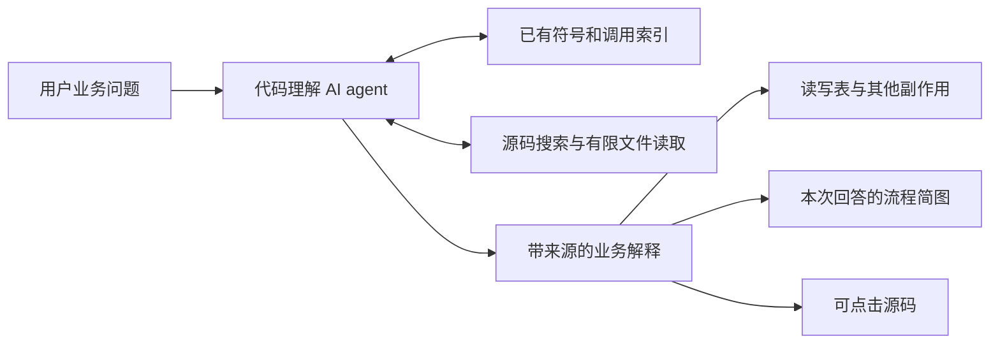

# AI 代码理解设计文档

版本：2.1。日期：2026-09-13。当前范围见[需求文档](requirements.md)。

后续扩展（2026-09-12，设计1.1、T0核心验证完成）：[Eclipse JDT LS 接入设计](jdtls-integration.md)与[开发任务](jdtls-development.md)。采用官方可选LSP插件，拆分公共客户端与编译期JDT适配器，引擎包独立安装；复用本版AI/来源体系，不替换基础索引，不改变CU2首阶段范围。下一项为JLS-T1；可信项目导入边界见接入设计第6节。

## 1. 核心方案

采用“已有索引导航 + AI 按需读代码 + 本次回答的证据与简图”。业务理解由 AI 完成，不先建立完整 Java/Spring/数据库语义图。

| 层 | 负责 | 不负责 |
| --- | --- | --- |
| 现有索引 | 找符号/路径，给调用和类型关系线索 | 证明运行时所有调用与所有读写 |
| 工具适配层 | 将索引和本地文件以有界、可引用的形式提供给模型 | 静态模拟 Spring、执行 SQL、任意命令 |
| 理解 agent | 制定搜索词，阅读源码，沿上下游追问，分析表读写与分支 | 未看源码就补造事实 |
| 结果校验/呈现 | 校验引用身份、范围和结构，显示解释、推断和简图 | 把结构校验等同语义绝对正确 |

索引中不存在的关系，只要 AI 通过源码查证，就可以成为本次回答的一部分；不强制先写入索引数据库。

## 2. 复用边界与当前代码

2026-09-10 工作区 HEAD 为 `59de3e4a0f05b5af5ac7a31142f9e43f5cf93065`，同时有 Java 解析等未提交修改。历史交接记载 schema v3、原始事实、SourceRef、EvidenceBundle、GraphSlice、AnswerDocument 等已落地。本轮不重复建库或回退这些资产；运行状态与实际测试应由下个实现批次核实。

| 现有位置 | 使用方式 |
| --- | --- |
| `src/code_index/store.rs` | 复用符号搜索、索引版本与现有存储 |
| `src/code_index/queries.rs` | 复用 symbol_detail、trace_calls、index_overview；作为导航线索而非最终业务答案 |
| `src/code_index/identity.rs` | 复用稳定符号、内容 hash、SourceRef |
| `src/code_understanding/types.rs` | 复用已有基础类型和严格校验；新增会话分析结果适配，不伪装成索引权威边 |
| `src/ai/client.rs` | 复用工具调用、SSE、代理、读空闲超时、重试与截断处理 |
| `src/ai/review_agent.rs` | 参考 agent 循环组织；不带入 diff、分支或 Git 工具 |
| `src/tasks.rs` | 使用 Ai 池，复用现有任务计数/取消方式，不使用 Long 池 |
| `src/syntax.rs`、UI helper | 复用代码着色、虚拟列表、输入、按钮与布局 token |

现有 trace_calls 每次整图载入且返回 hop 列表，不能把相邻 hop 项直接连成调用链。首版在工具适配器内缓存每问/同代索引快照，输出有界的一跳或少量关系；只有基准显示不足时才改为直接邻接 SQL。没有必要把全索引查询引擎重写设为 AI 开工前置任务。

## 3. 最少新增模块

| 拟新增模块 | 职责 |
| --- | --- |
| `code_understanding/tools.rs` | 六个只读工具，复用索引服务，统一参数/预算/结果包装 |
| `code_understanding/source.rs` | 有限源码搜索与读取，来源 ID、路径和文件版本检查 |
| `code_understanding/agent.rs` | 提问/追问上下文、工具循环、结束和取消 |
| `code_understanding/analysis.rs` | AI 业务发现、表读写、流程步骤的会话 DTO 与校验 |
| `code_understanding_view.rs` | 问答、来源查看和简图原生 UI；确有必要时再拆子 view |

无需新增 Spring/MyBatis/JPA 静态规则模块、向量库或业务图存储。仅为确定性的定位缺口补小型能力，例如“允许安全检索 Mapper XML”；不要因此开始实现 XML/SQL 全语义解析器。

## 4. 工具契约

agent 使用独立白名单，GUI 直接调用 Rust 服务，不启动本机 MCP 子进程绕一圈。每个工具返回 request_id、索引代际（适用时）、数据、来源/证据 ID、truncated 和原因。

| 工具 | 输入 | 返回与作用 |
| --- | --- | --- |
| search_symbols | 关键词、可选路径/语言、limit | 类/方法候选、范围、现有身份；中文问题可多次换英文词 |
| get_symbol | 稳定键或精确候选 ID | 定义位置、可用签名/注释、索引元数据；正文通过统一 reader 校验后读取 |
| trace_calls | 候选 ID、inbound/outbound、depth、limit | 已索引的关系线索及覆盖/策略；没有边不表示没有调用 |
| search_code | 文本或受限 regex、path/suffix、limit | 源码/注释/XML/SQL 中命中位置和短上下文；可查引用、注解、表名 |
| read_file | 合法相对路径、start_line、end_line | 当前文件有限行、内容 hash、服务发放的引用 ID；可读尚无符号索引的资源 |
| get_file_tree | 子目录、depth、limit | 有界目录结构，帮助找到 mapper/resources/model/security 等相关路径 |

首版不用专门的 find_tables 工具：AI 从读到的 SQL/映射中识别表与操作。需要查看调用的调用方时继续使用 trace_calls/read_file/search_code；不要增加任意 SQL/Cypher、shell、联网或数据库工具。

read_file/get_symbol 的引用由服务生成，模型不能随意指定一段路径行号变成“有效证据”。search_code 的短预览先视为定位线索，关键结论必须读取足够的上下文；尤其不能把文件里另一个方法的 SQL 关联到登录路径。

## 5. “登录逻辑”执行策略

1. **找到入口**：保留用户明确路径/类名；搜索 login、signIn、authenticate、登录及项目自身词汇，参考目录结构和路由/过滤器等文本线索。不是要求每次硬编码跑完这些词。
2. **读入口和核心实现**：定位 Controller/handler/main/过滤器等，阅读方法本体、关联字段/接口与关键调用。不同登录入口分别列出，必要时询问范围。
3. **向两边追踪**：既看被调用方，也检索调用方。索引结果只作线索；对关键边读调用位置。遇到接口多实现，搜索实现、注入点与相关配置片段，有证据才缩小候选。
4. **核对数据访问**：沿 Repository/Mapper/JDBC 调用找到 SQL、XML 或实体映射。不能在“调用了 UserRepository”处结束数据分析，也不能无关扩展到全项目所有表。
5. **检查其他路径**：阅读失败分支、异常处理及会话/缓存/消息等副作用；区分方法内逻辑与框架可能提供的行为。
6. **整理答案**：入口、关键步骤、调用上下游、读写表/对象、其他副作用、未确定处及来源；可视化投影为少量业务步骤。
7. **继续追问**：复用近几轮摘要与选中对象，重新读取需要的证据；不盲目发送全部历史工具输出。

停止条件：用户所问维度已有足够证据，继续读只会重复；或到外部/动态边界；或预算耗尽。答案说明尚未查证的部分。不存在“完成全仓库静态关系分析后才允许回答”的步骤。

## 6. Java 适配的实际含义

普通 Java 和 Spring Boot 都支持同一 agent 工作流。增强体现在检索指导和阅读材料上：

- 充分使用现有 package、import、类/方法、接口实现和调用索引；其正确性限制不隐藏。
- 模型遇到 Spring 代码时读取 Controller、Service、注入点、认证过滤器/配置及异常处理相关源码，而不是要求本地重建容器状态。
- MyBatis：先对齐实际调用方法与 namespace/id/SQL 注解；必要时读 include 与动态分支的原文。无需提前解析整个项目 XML。
- JPA/其他 ORM：读取调用与实体映射，物理表名未确认就写未确认；命名策略、级联等没有证据时不推断具体读写。
- 重载、Lombok、代理或复杂泛型导致索引不足时，继续源码查证或报告候选；不以新增语言特性测试数量作为业务交付指标。

这些是 agent 的阅读策略，不承诺 AI 总能消除运行时不确定性。未读到的 SQL、实现或配置不能由语言常识补成项目事实。

## 7. 回答数据结构与轻量兼容

已有 AnswerDocument/GraphSlice 校验强调“关系必须来自权威图”。保持该契约服务原有静态图，不直接将 AI 解释塞成新的 CALLS/INJECTS 表记录。

拟新增会话 DTO `AnalysisResult`（自身 `version=1`，独立于既有 ANSWER_PROTOCOL_VERSION）：

| 字段 | 作用 |
| --- | --- |
| context | project_key、request_id、index_generation、问题与实际检索范围 |
| summary / findings | 一句话回答与业务发现；每条 finding 含来源 ID 和 observed/inferred 状态 |
| callers / callees | 相关调用说明、涉及代码、来源、direct/indirect/candidate 和覆盖说明 |
| data_accesses | 对象、对象类别、操作列表、条件、访问方法、来源与 observed/inferred/unknown |
| steps / links | 业务步骤与显式连接，附来源；连接种类为 call/branch/read/write/sequence_hint 等展示语义 |
| unknowns / completion | 未确定内容及 complete/partial；范围内回答完成不代表全项目分析完成 |

对象类别区分 db_object/cache/external/message/unknown；数据操作区分 read/insert/update/delete/unknown，允许同对象多操作。未知对象可保留表达式；不可为了表格整齐捏造名称。

模型内部步骤 ID 只是本次回答的局部 ID，不要求每个步骤是数据库 SymbolKey。节点可以表示“校验密码”或“更新最后登录时间”，但必须关联已读代码的证据；table 节点可以来自 SQL 引用，不需要先落索引库。纯阅读顺序使用 sequence_hint，不能冒充真实调用或必然执行顺序。

**校验两层分开：**

- 服务验证结构、来源归属、文件 hash/行范围、所有 link 端点存在、数量限制；索引键若提供则必须可解析。
- AI 对源码做语义判断，UI 以“AI 根据源码分析”呈现；推断可见。人工验收判断结论是否被引用内容支持，不能把“引用存在”当正确性的充分证明。

这样既保留已有严格 DTO 的价值，也允许模型用源码建立业务层解释，而不必扩建静态语义 schema。

## 8. 表读写的证据要求

明确 SQL 的表/对象和操作：引用 SQL 本体以及它与当前业务路径的调用或映射来源。条件更新同时引用条件所在分支。对于 JOIN/子查询/INSERT…SELECT，应分别列读源和写目标；不能把别名/CTE 当新增物理表。

ORM 推断：至少引用调用和实体映射，标“按映射推断”。只有 `findBy...`/`save` 和实体名字时，先说明对象意图，物理表名未知。动态表名、存储过程、外部服务、不可见级联/触发器以未知边界结束。

同一表按对象与操作聚合展示，保留各条件和证据，避免成功路径和失败路径合并成“每次登录都会写”。缓存与外部调用单列。模型不得运行 SQL、访问数据库或读取密钥来补全答案。

## 9. 来源与文件变化

复用 SourceRef/hash 基础，只增加安全的本地 reader。项目路径从宿主获取，理解工具不依赖 GitService。

- 路径限制于当前项目允许目录；拒绝越界、符号链接/junction 根外目标、敏感排除路径、二进制与超大文件。沿用现有 ignore 选择规则。
- Mapper XML、SQL、实体等可在允许范围按需读，即使未建立符号节点。来源记录实际读取 hash；“属于本次查询的索引代际”不意味着资源已被索引。
- 每次读取保存来源片段和 hash；结束时/用户点击时检查所引文件。发现变化则标该发现过期、禁用精确跳转并提示重试，不按旧行号打开新内容。
- 同一文件在本问内变化，不混合两份内容形成一个确定结论；索引代际改变则结束本次为 partial/stale，不跨代追加索引证据。
- 路径/注释/XML/源码内容均是待分析数据，不能修改系统规则或工具权限。

工具只向已配置供应商发送问题所需的有限片段。输入区说明这一点；点击提问发起请求，不后台上传全库。日志只保留请求/耗时/数量和脱敏错误。

## 10. 预算、流式与生命周期

复用现有 Ai 池和 ChatClient 重试/超时/截断策略。首版保持以下内部默认，集中常量定义，不新增用户配置旋钮：

| 项目 | 默认限制 |
| --- | --- |
| 工具次数/模型轮次 | 40 次工具、41 轮总量，包含必要收尾与格式修复；批量调用逐项计数 |
| 单次读取 | 源文件 ≤ 1 MiB；read_file 最多 200 行且返回 ≤ 8K 字符，超限显式截断，可分段再读 |
| 其他工具 | 搜索默认 20/最多 50 命中；目录默认 2/最多 4 层且最多 200 条；trace 默认 1/最多 3 跳、最多 40 个符号 |
| 总上下文 | 工具累计 120K 字符，总输入保守估算 ≤ 48K token（包含提示、schema、历史等），收尾预留 8K 输入空间；输出沿用客户端配置 |
| 全部 HTTP 尝试 | 每问最多 80 次，瞬态重试同样计入，防止只按成功轮数限额 |
| 检索运行 | 单次本地搜索 ≤ 2s/最多 1000 个候选文件，先到即返回部分结果 |
| 展示 | 默认最多 15 步/20 连接；超限在文字说明中保留并提示聚焦，不截出悬空边 |
| 历史 | 会话内最近 5 次答案，发送给模型最多最近 3 次摘要、合计 8K 字符 |

模型窗口小于默认预算时下调或明确报错，不声称 48K 输入适用所有端点。补读请求可能达到输出截断，必须报告未完成，不能把半段 JSON 当成功。

流式阶段先显示查找/阅读进度，已有源码来源可见；仅渲染可解析的临时文字，禁止直接显示工具参数或 JSON。最终结果用普通工具调用兼容端点 + JSON 内容，不依赖供应商专有结构化输出；格式修复最多一次并计入总预算。仍失败保留已读来源，显示可重试错误。

状态分为 Idle → Validating → Running（Searching/Reading/Answering）→ Completed/Partial/Failed；运行中另有 Detached、CancelPending，终态还包括 Cancelled/Stale。事件携带项目键、标签会话键和请求代际，旧消息不能回填新问题或其他仓库。

普通切换页面、标签或仓库只把当前显示从 Running 变为 Detached，后台任务继续占用原 AI 名额并按原路由接收事件。用户回到原会话时恢复实时进度；任务在后台结束时发送一次完成提示，并仅在结果为结构有效的 Completed 或明确收尾的 Partial 时写入本地历史。Failed、Cancelled、流式半截正文和截断/坏 JSON 不写历史。

显式点击“取消”才进入 CancelPending：立即给用户“正在安全取消”的反馈，取消标志在工具或模型轮次边界生效，任务实际退出前不释放 AI 名额。取消完成后保留原问题供修改或重试，但不保存半截回答。索引代际或来源文件变化导致 Stale 时，已保存回答仍可读，失效来源不能按旧行号打开。

同项目单问答，全局复用现有 AI 任务限制；实现时使用共享许可或现有可用计数入口，不能因增加独立页面绕开既有并发上限。若需要小改共享计数，仅做必要兼容，不重构整个任务框架。

## 11. 用户入口与简图

遵循 [Calm Technical 设计系统](../ui-design-system.md)。左侧模式区增加“代码理解”；页头显示项目和索引状态。主要内容是问题输入和可读回答，输入示例为“登录逻辑怎么实现的？”。

答案采用与 Pencil 节点 `bi8Au` 一致的平面分区：完成状态 → 结论概述 → 横向业务步骤 → 数据读写表 → 并排的调用入口/尚未确认。调用上下游不再重复展开成大列表；来源入口分布在步骤和数据项中，按需打开右侧代码侧栏。

页面可见状态固定为六类：空态/恢复态、提交校验态、流式生成态、后台分离态、失败重试态、完成/来源态。空态同时提供问题输入、示例问题和最近完成记录；生成态保留已完成步骤并显示当前动作；后台态通过全局状态栏和任务条提供“查看进度/取消”；失败态保留问题、已完成步骤和明确错误；完成态才显示“已保存到本地历史”；来源态在 Java 语义增强不可用时仍允许基础只读源码，并禁用语义动作、提供设置入口。

简图直接由已校验的 steps/links 渲染为少量等宽横向步骤卡和小号箭头，可通过标题区收起。失败分支数量汇总在标题摘要中，避免在箭头下堆叠连接类型文字；循环和复杂分支留在结构数据与结论中，不无限复制节点。无需全图 SCC/力导向布局、缩放平移编辑器或复杂聚类。

宽屏回答加 360px 按需源码侧栏；剩余宽度不足时源码替换主区并提供返回，保留阅读位置。侧栏沿用 Pencil 的文件头、路径条、定义/实现/引用/调用方/被调用方页签、源码行和复验说明结构。正文、间距、圆角、分隔和深浅主题复用 token。按钮/输入/滚动/虚拟列表遵守 AGENTS.md；不新增图键盘导航。Ctrl+P 原行为不变，额外入口不是首版必要项。

T5 的主界面、用户流程、六种页面状态、Java 语义源码视图和官方插件设置入口已在 Pencil 中细化；实现仍须使用现有 GPUI 原生组件、主题 token 和壳层。设计稿不是验收替代品，完成后仍需实际 GPUI 截图与交互验证。

## 12. 首版不需要的基础设施

不升级索引 schema 来存表或业务流程，不继续强制补 Java 全语法，不实现 Spring 容器/SQL 血缘，不建向量库，不先重写完整查询引擎，不缓存持久“AI 业务知识图”。已有重型基础仅在能直接提高定位时复用。

首个技术交付应是：不借助新 UI，调用理解服务对一个登录样例给出准确的入口、调用关系、读写对象与来源。测试如何执行见[开发文档](development.md)。
