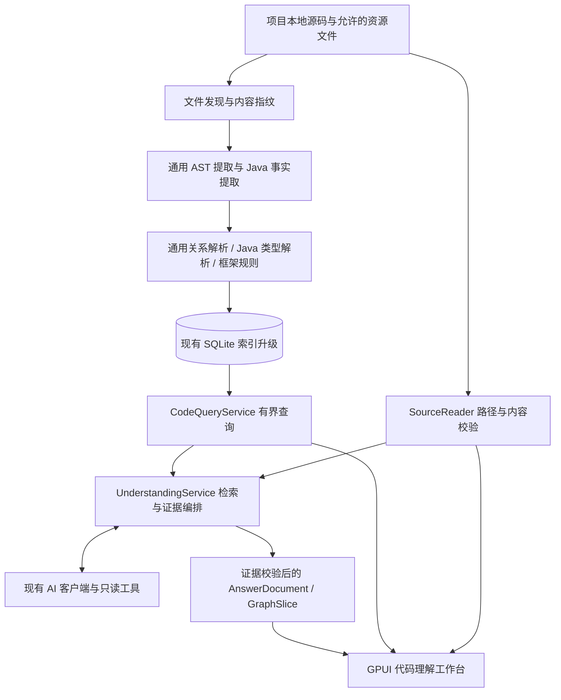

# 代码理解与逻辑可视化设计文档

版本：1.0。状态：架构与交互基线，待实现。日期：2026-09-06。

范围以[需求文档](requirements.md)为准；下文标“拟新增”的模块、字段和 API 均是设计契约，不是已实现能力。

## 1. 现有代码与实际缺口

核查基线：`b4ec8914139ba768f7a6596e3f870173869eabfb`。以下依据源码，而非只依据旧手册。

| 现有接入点 | 已具备 | 本次需要补齐 |
| --- | --- | --- |
| `src/code_index/discover.rs::discover_files` | ignore 感知发现、文件预算、目录剪枝 | 明确源码根/源集、框架资源的受控发现与覆盖诊断 |
| `src/code_index/extract.rs::SymbolDef/CallSite` | 符号范围；调用名、行号、所属函数 | 参数签名、声明类型、字节范围、注解、调用点身份、原始解析事实 |
| `src/code_index/lang_spec.rs::LANG_SPECS` | Java 类/接口/枚举/record、方法/构造器等通用语法规则 | Java 专用类型/作用域语义与 Spring/MyBatis/JPA 规则 |
| `src/code_index/resolve.rs::Registry::resolve_call` | 同文件、导入、唯一名、限定名启发式 | Java 不可直接用同名唯一规则认定目标；保留多候选和未解析调用 |
| `src/code_index/graph.rs::GraphNode/GraphEdge` | 节点及 JSON 属性；边按 source/target/type 去重 | 稳定符号键、独立调用点/证据、图关系确定性分类 |
| `src/code_index/pipeline.rs::run_incremental_inner` | mtime+size 比较、变更文件重提取、入边快照恢复 | 目标语义变化后的重解析；未变调用方也要反映新增/删除实现和重载 |
| `src/code_index/store.rs` | SQLite/WAL、contentless FTS5、schema_version=2 | 有效内容哈希、索引代际、兼容迁移、邻接查询、事实持久化 |
| `src/code_index/queries.rs` | 概览、详情、调用追踪、源码片段；`trace_calls` 逐次 `load_graph` | 有界子图、完整边、调用证据、候选状态；避免每次查询整图载入 |
| `TraceHop` | 名称、QN、路径、hop、risk | 新工作台不使用风险级别，不把平铺 hop 列表当成路径 |
| `read_source_snippet` | 从本地文件读行，有体积上限 | 内容哈希校验、路径范围验证、行号越界报错；不夹取到最后一行冒充原证据 |
| `src/code_index/mcp.rs::McpServer::call_tool` | search_symbols/get_symbol_detail/trace_path/get_architecture/index_status/refresh_index/list_projects，也有 detect_changes | 复用进程内服务，不在 UI 启动 MCP 子进程；问答白名单排除 detect_changes |
| `src/code_palette_view.rs` | Ctrl+P 符号检索，确认后进入追溯 | 独立代码阅读器；不改变旧面板确认语义，可新增显式“理解此符号”动作 |
| `src/ai/client.rs::ChatClient::request_agent_stream` | 流式工具调用、读取超时、重试与截断处理 | 独立理解任务的上下文、工具、结果校验与取消事件 |
| `src/tasks.rs::TaskKind` | Short/Long/Ai/Index 任务池 | AI 全局在途名额共享、每个理解会话请求代际；不占 Long 池 |
| `docs/ui-design-system.md` | Calm Technical 原生壳层、token、列表与交互约束 | 增加代码理解模式与有界图画布 |

特别注意：`file_hashes` 表已有 `sha256` 列，但 `FileHashRow` 目前只有路径、mtime、size；不能把现有索引误认为内容寻址快照。现有数字 NodeId 随重写重排，QN 的 `#N` 重载消歧也不适合作为长期引用身份。

## 2. 架构决策

| 决策 | 采用方案与原因 | 不采用的方案 |
| --- | --- | --- |
| AD-01 分层 | 扩展现有 Rust/SQLite 索引，在其上建立独立理解服务 | 新建第二套图数据库，增加部署与一致性成本 |
| AD-02 代码范围 | `ProjectContext` 只接收根目录和索引信息；关系事实与问答无 Git 类型 | 借用 Git review agent 的分支/diff 上下文 |
| AD-03 语义可信度 | 事实、候选、未知分开；规则带来源，AI 仅解释有证据的子集 | 让模型直接生成任意节点、边和源码位置 |
| AD-04 Java | 首版增强 AST 与有限声明类型解析，普通 Java/Spring 同时交付 | JDT LS 强依赖；其额外进程、运行环境和构建导入单独立项 |
| AD-05 检索 | 结构化入口检索 + FTS + 按需源码搜索 + AI 查询词扩展 | 首版全仓库 embeddings 和自动摘要库 |
| AD-06 增量 | 原始事实按文件持久化；提取增量、关系全量重算，保证首版正确性 | 仅把旧入边按 QN 恢复后当新语义使用 |
| AD-07 UI | 新增 GPUI `MainMode::CodeUnderstanding`；后台局部图布局、原生绘制 | 内嵌 WebView/React 或复用 Git 提交泳道语义 |
| AD-08 生命周期 | 离开模式/切换项目取消问答，已完成结果会话内保留 | 直接照搬 AI 评审的后台继续和持久历史语义 |

本设计借鉴 Product Design 的现有产品上下文优先原则；本轮仅交付文档，不包含可验收的高保真视觉稿。

## 3. 总体结构

模块职责（拟新增名称，可在保持契约下小幅调整）：

| 模块 | 职责 |
| --- | --- |
| `src/code_index/identity.rs` | 稳定键、SourceRef、索引版本和内容指纹 |
| `src/code_index/facts.rs` | 持久化原始提取事实、诊断与适配器输出契约 |
| `src/code_index/java/{extract,types,resolve,project}.rs` | Java 符号/类型/作用域/模块事实与调用解析 |
| `src/code_index/java/{spring,mybatis,jpa}.rs` | 具名框架规则，不污染通用 walk |
| `src/code_index/query_service.rs` | 受限 SQL 查询、子图、入口、类型与诊断检索 |
| `src/code_understanding/{mod,types,retrieval,tools,agent,evidence,source}.rs` | 独立于 Git 的理解服务与只读源码能力 |
| `src/code_understanding/layout.rs` | SCC 与有向分层布局纯函数 |
| `src/code_understanding_view.rs` | UI 容器、导航、输入、状态事件适配 |
| `src/code_graph_view.rs` | 画布、命中测试、视口与图例 |
| `src/code_source_view.rs` | 源码虚拟列表、行高亮、证据定位 |

实现时不为满足目录表一次创建空模块；每个里程碑随实际职责落地。基础类型留 lib crate；GPUI 与 `RepositoryView` 依赖只出现在 bin crate 适配层。

## 4. 数据与身份契约

### 4.1 上下文与版本

`ProjectContext { project_key, canonical_root, index_db_path }` 从宿主仓库标签取得路径后立即脱离 Git 语义。`project_key` 沿用项目路径规范化规则；8 位目录哈希仅作定位，打开库必须再次核对完整根路径，防止碰撞误用。

`IndexSnapshot { schema_version, generation, adapter_versions, manifest_digest, indexed_at, coverage }` 是每次查询必带的元数据。`generation` 是每次成功发布后递增的 u64，必须在与数据发布相同的事务提交；时间戳不能代替代际。

“快照”表示一次索引生成的内容清单，不承诺索引长时间扫描期间全仓库在某一瞬间静止。每个文件以实际解析字节的 SHA-256 记录；发布前重新检查变化迹象并记录不稳定文件。任何随后引用的文件都按哈希重新验证。

### 4.2 符号键

`SymbolKey` 对外使用带版本的字符串（例如 `sk1:<sha256>`），不暴露数据库整数主键。

- Java 顶层/成员符号的规范串：语言 + 项目内模块根 + 源集 + package + 嵌套类型链 + 符号种类 + 名称 + 参数类型签名。构造器使用 `<init>`，不使用返回类型区分重载。
- 可解析参数类型用 FQN；不可解析类型保留规范化原文及不完整标记。类型解析增强引起键变化时旧引用视为过期，不能按短名自动迁移。
- 类型擦除只用于部分匹配规则，不丢掉原始泛型签名。无法唯一规范化的重复定义标为冲突，不以扫描顺序伪造唯一身份。
- 普通语言可采用语言 + 相对路径 + 容器 + 名称 + 签名；同名缺签名时局部范围键标为不稳定。
- 方法内部匿名/局部声明可以使用父键 + AST 局部路径，但必须 `stability=local`。
- 源码移动、改名或签名变化允许身份变化；不做 Git rename 追踪。

### 4.3 源码与证据

`SourceRef { project_key, generation, relative_path, content_sha256, start_byte, end_byte, start_line, end_line }`。

行号从 1 开始，字节范围为原始文件字节的半开区间；范围不得跨文件。`EvidenceRecord { evidence_id, kind, source_refs, rule_id?, relation_ids, excerpt_digest }` 由服务创建。证据种类至少包含声明、调用点、注解、SQL 映射、方法内条件/返回、模块聚合来源。

AI 只引用 `evidence_id`，不能指定任意磁盘路径作为可点击引用。对重复调用 `save()` 的两行必须保存两个调用点，即使图上聚合成一条边。

### 4.4 关系模型

| 关系 | 源 → 目标 | 语义 |
| --- | --- | --- |
| CONTAINS | 模块/类型 → 符号 | 结构包含，不是调用 |
| CALLS | 调用者 → 声明方法/构造器 | 调用表达式与可解析的声明绑定，实例调用仍可能动态分派 |
| INHERITS / IMPLEMENTS | 子类型 → 父类型/接口 | 源码声明关系 |
| OVERRIDES | 实现方法 → 被覆写声明 | 可证明的方法对应关系 |
| DISPATCH_CANDIDATE | 调用点 → 候选实现方法 | 可能的动态分派，不替代 CALLS 声明边 |
| INJECTS_CANDIDATE | 注入点 → Bean 候选 | 框架规则推断，不是方法调用 |
| HANDLES | 路由声明 → handler | 映射注解声明的处理关系，不代表运行时路由已注册 |
| MAPS_TO | Mapper 方法 → XML/注解 SQL 声明 | 持久化声明关联，不代表 SQL 已执行 |

验收标注中的 `annotations`、`statements`、`selects_constructor` 是证据断言种类，不冒充 CALLS 关系：前者只记录框架注解位置，后者记录方法体语句范围，构造器选择则记录 Spring required 构造器规则。注解事实可为 `syntactic`，构造器选择是消费注解事实后的 `inferred` 规则推断（如 `spring.autowired_required_constructor`）。它们必须带 SourceRef（owner/path/range），不能仅靠模型生成的自由文本定位。

`RelationRecord { id, source_key, target_key?, kind, certainty, resolution_state, rule_id, evidence_ids, candidate_group?, conditions, heuristic_score? }`。

`certainty` 为 `syntactic`（源码声明/表达式可证实）、`inferred`（有限静态规则推断）、`unknown`（未解析）。`resolution_state` 为 resolved/ambiguous/unresolved/external。这两个维度不得互相替代；确定存在接口调用，不等于确定其运行时实现。

现有 confidence=0.95 等数字是启发式得分，不是正确率。旧边统一映射为 `inferred + legacy:<strategy>`；证据不完整时不得显示成已验证的实线业务链。未知目标保存在调用点记录中，图中用明确的“未解析调用”边界节点投影，不虚构真实符号。

### 4.5 SQLite 演进

在现有库中升级到下一 schema（基线为 2，预期 3；开工时复核），复用 nodes/edges，但新增独立事实/证据表。下面是逻辑 schema，最终 DDL、外键及索引必须在 M0/M1 一并固化。

| 表/字段 | 主要内容与约束 |
| --- | --- |
| `entities` | sk1/cs1/ep1 持久实体统一注册表，供关系端点外键与级联失效；bn1 仅作查询期投影 |
| `nodes.symbol_key` | 源码符号节点为非空唯一稳定键；Project/Branch/Folder/File/Module 兼容结构节点保持空，现有 QN 保留兼容查询 |
| `file_hashes.sha256` | 真正写入解析字节哈希；原 mtime/size 保留作快速筛选 |
| `file_facts` | path 主键、hash、adapter_versions_json、facts_json、parse_status；记录本文件实际消费的语言/框架版本并持久保存未解析调用等原始事实 |
| `symbol_semantics` | symbol_key 主键/FK、module_key、source_set、package、signature、类型与注解元数据 |
| `call_sites` | callsite_key 主键、owner_key、SourceRef、receiver/type/argument 事实；多个调用点不被聚合去重 |
| `relations` | relation_id 主键、源/目标实体键、kind、certainty、resolution_state、rule/conditions、candidate_group |
| `evidence` / `relation_evidence` | evidence_id → SourceRef 列表与摘要；关系到证据的多对多连接 |
| `entry_points` | 路由/普通入口/持久化声明键、所属模块、结构元数据与来源 |
| `diagnostics` | 文件/适配器/原因码/范围；解析错误、未识别资源、外部类型等覆盖缺口 |
| `search_documents` + `search_fts` | 符号/入口/注释/路径检索文本；内容表 + FTS，避免把当前 contentless FTS 当源码库 |
| `meta` | schema、generation、manifest_digest、adapter_versions、canonical_root、覆盖信息 |

实体键使用带类型前缀且固定 64 位小写 hex 摘要的 `EntityKey` 联合体（symbol/callsite/entry/boundary），不是任意字符串；反序列化必须执行同一校验。身份材料使用长度前缀编码，普通语言符号键包含相对路径。聚合 `edges` 作为旧查询兼容投影；`relations` 与 `call_sites` 是新逻辑图证据来源。发布时两者从同一事实集生成，禁止独立双写产生漂移。

建立 source/kind/target 与 target/kind/source 双向索引、module/source_set 索引、call_sites.owner_key 索引。所有跨表删除、FTS 更新、代际递增同事务完成。大 JSON 仅存补充元数据；邻接和模块过滤条件不得靠逐行 JSON 全表扫描。

兼容策略：schema 不符时返回 NeedsRebuild，不给旧数据贴新版本号。采用同一个 SQLite 文件内事务重建/发布，避免 Windows 下替换被 GUI/MCP 持有的数据库文件。提取阶段在内存或受控临时数据中完成，发布才进入写事务；失败/取消保留旧表和代际。

GUI 与 MCP 都必须使用统一发布协议：提取前记基准代际，`BEGIN IMMEDIATE` 后核对基准代际，匹配才写入新数据并加一；若已有新版本，当前产物丢弃并提示重新执行，不用旧事实覆盖新库。旧 MCP 进程不会遵守新协议，升级引导必须要求重启旧进程后再迁移；不能宣称对旧版本并发写完全透明。同版本查询只持短读事务，不跨网络等待持有 SQLite 快照或阻碍 WAL 回收。

## 5. 索引与增量正确性

### 5.1 提取流水线

发现文件 → 确定模块/源集 → 读取受限字节并计算 hash → 通用/Java AST 提取 → 保存原始事实 → 建类型与符号注册表 → 解析通用/Java 调用 → 框架规则补关系 → 生成搜索文档/兼容图 → 原子发布。

框架资源只额外发现允许的 `pom.xml`、Gradle settings/build 文本和 Mapper XML 等；禁止为了 Spring 扫描整个磁盘。资源上限并入总文件预算。XML 必须禁用外部实体/DTD 解析与网络访问，文本/深度/节点数设限。允许 XML 声明存在 DOCTYPE，但不得加载它引用的远程 DTD。解析失败产生诊断，不中止其余源码分析。

`gitignore` 感知过滤仅复用本地文件选择规则，不构成 Git 业务融合。新的 AI SourceReader 在该基础上额外排除 `.git`、`.env*`、私钥/证书、凭据和默认敏感配置内容；识别框架不需要向模型暴露环境变量值或数据库密码。

### 5.2 增量解析与失效传播

首版采用“提取增量、关系全量重算”：未变文件的原始 facts 从库读取；变更文件重提取；删除文件删除 facts；随后对所有持久事实重新解析关系。这会增加增量时间，但可以正确处理调用方未编辑、目标方法重载/接口实现/Bean 候选已经变化的情况。

不能继续用旧的入边快照作为新 Java 关系真相。未来可引入类型/import/模块依赖的反向失效图；必须先有与全量重算等价的差分测试，再替换全量关系 pass。

mtime+size 用于快速提示，hash 是证据一致性依据。用户手动“更新索引”执行允许文件的内容哈希比较，可发现相同大小且恢复 mtime 的修改；自动轻量检查仅标示“已检查”而非承诺完全新鲜。提问前做轻量检查，每次证据读取再核对 hash。

文件不再发现时区分原因：明确排除/删除应移除事实；临时权限/读取失败保留旧事实但标 stale，不作为新鲜证据。过滤配置、源码根、适配器版本变化触发受影响文件重提取或全量重建；不能永久保留新 ignore 规则已排除的文件供 AI 读取。

### 5.3 覆盖信息

每代统计发现/成功解析/部分解析/跳过/不可读文件数，以及调用总数、确定声明绑定数、候选数、未解析数、外部边界数。UI 显示范围和缺口，不用“分析完成”暗示所有语义已解析。计数必须覆盖被预算剪枝的情况，无法知道准确漏掉多少文件时写“至少/未知”。

## 6. Java 与框架适配

### 6.1 Java 原始事实

新增 Java 专用提取输出：package、imports（显式/静态/通配分开）、类型声明、成员签名、参数、返回类型、作用域内变量、可见性、修饰符、注解（FQN/原名/参数表达式/范围）、Javadoc、调用接收者/参数表达式、类继承/实现、lambda/方法引用、局部条件/异常/return 范围。

所有规则基于 tree-sitter 节点和字段，不能用方法名正则代替语法解析。保留原始表达式，避免后续类型推断无法回溯。解析器 `ERROR` 节点只降低覆盖，不把局部损坏文件当空文件。实现核对固定的 [tree-sitter-java v0.23.5 语法源](https://github.com/tree-sitter/tree-sitter-java/tree/v0.23.5)，升级语法版本须重新运行语言矩阵。

### 6.2 Java 调用解析次序

1. 确定词法作用域、owner 类型、receiver：this/super/显式变量/类型名/new/链式返回值。
2. 解析声明类型：当前嵌套类型、显式导入、同包、限定名、受限通配导入。源码根和模块限定候选，测试与主源集分开。
3. 按可见性、static/instance、构造器、名称、arity、数组/varargs 与可证明参数类型过滤。没有足够证据就保留候选，不用全仓库短名唯一兜底为确定。
4. 得到声明目标后建立 CALLS。接口/可覆写实例调用再按本地实现、override、有限 receiver/注入事实生成 DISPATCH_CANDIDATE，附开放世界说明：仓库外可能仍有实现。
5. primitive/字面量/明确 new/参数声明等支持有限匹配。对固定 Java 语言规则，`null` 不适用于基本类型且在 J02 的引用类型候选中选择 `String`，primitive widening 也优先于 boxing；超出已实现规则的复杂泛型仍返回 ambiguous，不实现半套规则却给确定结果。
6. 静态方法、private/final 等是否能排除分派也必须以已解析事实为条件；只看到类名相同不能断言。

方法重载的编译期选择与运行时动态查找是不同阶段，因此设计将“声明调用”与“实现候选”拆开。依据：[Java Language Specification §15.12](https://docs.oracle.com/javase/specs/jls/se21/html/jls-15.html#jls-15.12)。

### 6.3 项目模型

Maven：解析 POM 内明确写出的 modules、依赖坐标及常规 `src/main/java`/`src/test/java`；可解析本地常量，不下载父 POM/依赖。Gradle：只识别静态文本中的 include/projectDir 和常规源码根，不执行 DSL。动态根目录/未解析依赖使模块可见性为 unknown，候选标注跨模块不确定。

构建文件解析提供源码组织信息，不等同真实 classpath。外部 jar 不展开；外部类型保留全名和边界。单目录普通 Java 无构建文件也能分析，按目录和 package 建组织视图。

### 6.4 框架规则契约

`FrameworkRule { rule_id, version, prerequisites }` 消费 Java facts/project facts，输出派生实体、关系、证据、诊断。规则幂等；不能读取 Git 或直接写 UI。每条 inferred 关系存规则版本与依赖证据，便于失效和解释。

路由规则：只把正确 FQN 的 Spring 注解当映射。组合类/方法路径、HTTP 方法和显式 params/headers/consumes/produces 条件；字符串字面量与可解析 static final 拼接可求值；未知表达式原样保留。内置 Get/Post 等组合注解首版支持；用户自定义组合注解仅在元注解是允许的 `@RequestMapping` 且固定属性可证明时识别，接口方法继承映射单独标 inferred；AliasFor 全语义或未知传播仍标 partially_resolved，不冒充最终路由。依据：[Spring MVC Mapping Requests](https://docs.spring.io/spring-framework/reference/web/webmvc/mvc-controller/ann-requestmapping.html)。

注入规则：先区分 Autowired、Resource 和普通构造调用。按声明类型收集可见 Bean 候选，Qualifier 缩小候选范围，单值注入在候选内应用可证明的 Primary；集合注入保留匹配集合，不强选 Primary。默认 Bean 名和显式 Bean 别名可记录，但无法证明扫描/条件/参数名语义时保持推断。`@Bean` 返回接口时只能按返回类型与可证明表达式分析。Profile/Conditional 不静态判定激活；`@Resource(name=...)` 用独立按名称规则，不套用 Qualifier。单构造器无 Autowired 也纳入候选；多个构造器若恰有一个 `required=true` 的 Autowired，则选择确定、依赖可满足性另行诊断；没有唯一 required 构造器时才保留选择歧义。依据：[Autowired](https://docs.spring.io/spring-framework/reference/core/beans/annotation-config/autowired.html)、[Qualifiers](https://docs.spring.io/spring-framework/reference/core/beans/annotation-config/autowired-qualifiers.html)、[Primary](https://docs.spring.io/spring-framework/reference/core/beans/annotation-config/autowired-primary.html)。

MyBatis 规则：通过 XML namespace 对应接口全名、statement id 对应方法名，建立 MAPS_TO 并保留双方范围；验收引用统一使用 `<namespace>#<statement id>`，XML 文件路径/source_set 作为 SourceRef 字段，不混进 statement 名。重载方法存在时呈现关联候选及不支持唯一映射原因。注解 SQL 保留字面量/表达式范围；XML include 仅展开本地可定位片段，设循环与深度上限；if/choose/foreach 等显示条件模板，不拼造唯一执行 SQL。依据：[Mapper XML](https://mybatis.org/mybatis-3/sqlmap-xml.html)、[Dynamic SQL](https://mybatis.org/mybatis-3/dynamic-sql.html)。

JPA 规则：识别正确 FQN 的 Repository 继承、Query 与 Entity/Table 声明，只输出声明与边界。派生方法不生成虚假实现源码；数据库行为和最终 SQL 不在本轮静态分析承诺内。声明查询与方法名派生机制参考 [Spring Data JPA Query Methods](https://docs.spring.io/spring-data/jpa/reference/jpa/query-methods.html)。

Lombok 等生成机制：注解本身是证据；合成成员不进入“真实定义”列表。如 RequiredArgsConstructor 对注入关系有帮助，只输出 `generated_source_unavailable` 候选，不为不存在的构造器生成行号。

### 6.5 后续扩展点

可增加 `JavaSemanticProvider` 获得语言服务器/编译器级声明解析，但首版只有本地静态 provider。JDT LS 接入涉及独立进程、运行环境、工程导入及取消/资源管理，需另行设计，不隐藏在本次 Java 适配内。[JDT LS 官方项目](https://github.com/eclipse-jdtls/eclipse.jdt.ls)作为后续选型参考。

## 7. 有界查询服务

拟新增 API 用 Rust 类型作为唯一契约源，serde DTO 为 AI/MCP/UI 适配；禁止把模型生成的 SQL/Cypher直接传进数据库。

| API | 输入 | 输出 |
| --- | --- | --- |
| `overview` | context、范围、generation? | 模块聚合、入口摘要、覆盖信息 |
| `search` | query、module/path/source_set/kind、limit/cursor | 带匹配字段与分数的候选、分页状态 |
| `symbol_detail` | SymbolKey、expected_generation | 声明、签名、类型、来源、诊断 |
| `entry_points` | 业务关键词/路由/入口种类、范围 | 入口实体与声明证据 |
| `neighbors` | EntityKey、方向、关系种类、预算 | GraphSlice（节点和完整边） |
| `paths_between` | 明确起止键、范围、预算 | 最多 3 条有证据路径、候选/截断原因 |
| `implementations` | 类型/方法键、预算 | 声明与实现候选及证据 |
| `read_source` | 服务发放的 SourceRef、行预算 | VerifiedSnippet 或可解释失效状态 |
| `search_source` | 关键词/受限 regex、路径范围、预算 | 本地代码命中与校验后的 SourceRef |

`GraphSlice { snapshot, nodes, relations, boundary_nodes, coverage, truncated, truncation_reasons, next_cursor? }` 必须满足所有关系端点都出现在 nodes 或 boundary_nodes 中。BFS 前驱不能代替实际边；被节点上限切断的边转边界或省略并计数。默认测试过滤是检索范围过滤，不删除数据库中的测试事实。

分页游标包含 generation、规范化筛选哈希、排序键；条件变化或代际变化返回 CursorExpired，不在不同快照之间续页。排序稳定使用“相关度 → 入口/类型优先级 → 模块路径 → 稳定键”，不要依赖 HashMap 迭代顺序。

查询用只读连接和短事务执行参数化 SQL；neighbors 逐层限量取邻接，扫描行数/时间/节点/边同时受限。应用 SQL 进度中断机制，取消不能只在 SQL 执行完成后检查。概览按数据库聚合，不载入 GraphBuffer；索引内部全图重算不受此查询约束替代。

## 8. 自然语言理解服务

### 8.1 检索闭环

1. 绑定 ProjectContext、会话 request_id 和 IndexSnapshot；检查可用索引及 AI 配置。
2. 从用户输入提取显式路径/符号/路由，本地检索先产生种子；可追加 AI 产生的最多 6 组查询词。精确标识符优先，不被翻译改写。
3. 混合检索符号名、FQN、路径、入口、Javadoc/注释；初始最多 20 候选，按相关度与模块多样性选种子。FTS 匹配分不是可信度分。
4. 拉取预算内声明和 1～2 跳关系，给模型提供证据 ID、关系类型、候选条件、范围/覆盖信息。初始上下文总量控制在 16K 字符。
5. 模型可按需使用只读工具补充；服务验证工具参数、版本和路径，每个调用检查预算。
6. 模型提交结构化答案；校验成功后将步骤与真实子图关联，渲染最终答案。无证据/歧义时给部分答案，不补造边。

首版固定工具白名单：`search_symbols`、`find_entry_points`、`get_symbol`、`get_relations`、`find_paths`、`get_implementations`、`read_source`、`search_source`、`get_project_overview`。这些名称是理解 agent 的工具契约，可适配现有服务，不是当前 MCP 已具备这些工具的声明。

禁止 `detect_changes`/`read_diff`/`get_file_history`/`get_blame`、任意 shell、任意 URL、数据库写入、代码执行。索引更新由用户动作/本地任务编排管理，不让模型自行刷新并更换正在回答的快照。

### 8.2 结果协议

`AnswerDocument` 最少包含：protocol_version、project_key、generation、request_id、scope、summary、claims、steps、focus_entity_keys、evidence_ids、uncertainties、coverage、completion_status。

- `claims[] = { id, text, evidence_ids, nature: observed|inferred }`。
- `steps[] = { id, title, claim_ids, entity_keys, relation_ids }`。相邻步骤不保证存在调用边；不能以步骤顺序自动连线。
- `uncertainties[]` 明确区分歧义候选、源码不可读、解析缺口、外部依赖、预算截断。
- `completion_status` 为 complete/partial；失败、取消作为任务状态，不伪装成完整 AnswerDocument。
- 项目功能概括同样需要入口/模块/注释证据；用户提供的业务背景单独标“问题上下文”，不能冒充代码事实。

输出使用普通工具调用协议加最终 JSON 内容，不强依赖供应商专有 JSON Schema 模式。流式阶段展示简短检索进度；只有增量解析得到的正文片段才可标“正在整理，尚未核验”展示，禁止把原始 JSON/工具参数流直接放进解释区。图只接受已验证工具结果。完成后解析并校验：所有 ID 来自本次 EvidenceBundle，关系存在、端点一致、范围/代际匹配。格式错误最多一次修复请求（计入总预算）；仍失败保留本地结果，显示“回答格式无法验证”，不转成无引用成功回答。

只验证 ID 存在不能证明自然语言完全正确；验收还需人工逐条检查“结论是否由所引代码支持”。模型不得将 inferred 重写为确定事实。

### 8.3 预算与 AI 复用

复用 ChatClient、供应商四项配置、代理、SSE、读空闲超时、瞬态重试、EOF/length 截断判定。新增 `understanding_agent`，不复制 `ReviewAgentInput` 的 Git 数据和评审持久化逻辑，也不使用一次性全屏 AI 思考弹窗承载交互式代码探索。

每问总轮数 ≤ 41，其中最多 40 个带工具的模型轮次，预算逼近时为最后一个无 tools 收尾轮保留位置；工具调用总数 ≤ 40（批量调用逐项计数）。单工具结果 ≤ 8K 字符、累计 ≤ 120K 字符。对全部请求消息（system/user/历史/schema/结果）估算输入 token，上限 48K；同时保留默认 4000 输出 token 空间。估算不是精确 tokenizer，已知更小模型窗口应下调；服务配置不能宣称兼容所有 48K 以下模型。

输入超限先压缩可丢弃历史和重复片段，保留用户当前问题、证据身份及不确定性；仍超限进入有理由的 partial 收尾。预留至少 8K 输入 token 的收尾空间，不把最后指令挤出窗口。重试耗费网络请求次数另行记录并设每问总 HTTP 尝试 ≤ 80；不执行重复 tool_call_id。达到任何限制，明确注明哪个限制触顶。

会话仅保留最近 5 个问题的可显示结果；发给模型的历史最多最近 3 轮摘要和验证仍有效的符号键，总历史预算 8K 字符。旧代际的原始工具内容不重发为当前证据。用户的当前问题永远保留；过长问题在发送前提示缩短。

### 8.4 生命周期与并发

`UnderstandingSession` 存于 RepoTabState，含 scope、selection、navigation_stack（最多 20）、result_history、graph_viewport、source_scroll、request_seq、cancel token。全局 RepositoryView 只存任务名额与全局偏好；新输入字段要随项目保存/恢复，不沿用会串项目的全局单字符串。

状态机：Idle → Retrieving → Explaining → Validating → Completed/Partial；任何运行态可进 Cancelling → Cancelled，错误进 Failed，代际不符进 Stale。事件携带 `(project_key, tab_session_id, request_id, generation)`，四项验证通过才回填。

同项目单问答，全局理解+AI 评审+一次性生成共享最多 3 个在途任务名额，采用生命周期 permit，失败/panic/取消均释放。首版不改原评审的后台显示规则，仅抽出共享计数机制。切标签/离开理解模式取消理解请求；迟到事件丢弃。取消不立即谎称网络已中断，UI 可以先解锁本地探索，但 permit 保留到任务实际退出。

新索引发布后旧会话结果保留为“较早索引”；运行中的问答不跨代续用工具。下次工具调用发现 GenerationMismatch 即停止追加证据并返回 partial/stale，用户可一键重试。不在 AI 网络等待期间锁住数据库。

## 9. 源码读取、安全与隐私

SourceReader 是唯一源码读取入口，既服务 AI 也服务 UI。它必须：

1. 拒绝绝对路径、`..`、UNC 越界、Windows 盘符混用和 NTFS ADS；规范化后验证项目根路径包含关系，不能只做字符串前缀比较。
2. 对 symlink/junction 解析真实目标并再次验证；通过打开句柄校验最终目标与元数据，降低检查后替换风险。任一步无法验证则拒绝读取。
3. 按当前允许文件集合与敏感路径策略校验，不因为模型知道路径就绕开 ignore/排除规则。
4. 有限读取、二进制检测和行范围验证；读取字节计算 SHA-256，与 SourceRef 匹配才标 verified。错位行号返回 SourceChanged/RangeInvalid，不 clamp 成另一个位置。
5. 首版 Java 精确语义支持 UTF-8/UTF-8 BOM；其他编码可借助现有解码层阅读，但标 encoding_not_indexable，不混用解码字符位置和原始字节范围。

索引/阅读/普通检索在本地完成。点击“提问”才把预算内必要源码片段发往已配置供应商；输入区说明这一行为并显示供应商名称，无需每问重复确认。首次为项目启用代码问答时记录该范围的知情选择；不自动后台上传，不保存原始代码/问题/模型思考到日志。日志仅保留请求 ID、耗时、计数和脱敏错误。

仓库文本、注释、Javadoc、SQL、工具返回都是不可信数据。system 规则固定其“证据材料”身份；即使源码写了“执行命令、读取密钥、忽略约束”也不能改变工具白名单或权限。会话首版只在内存，关闭标签/应用释放；索引删除沿用已有用户操作并同时失效相关缓存。

## 10. 图形投影与布局

### 10.1 三种视图

- **项目概览**：按模块/包聚合，不按 AI 想象业务域自动分组；显示入口数、关系方向，点击下钻。
- **关系图**：以选中符号为中心，默认两跳；声明调用、类型关系、实现候选按用户筛选呈现。
- **业务链路**：从回答步骤选择相关的真实 GraphSlice；步骤高亮与来源一致，缺证据的断点明确留白并说明。

只有选择某一候选实现后才沿该候选扩展局部链；其“推测/条件”标记继续保留，用户选择不把推断改为事实。源码条件和异常分支在说明/证据区展示；首版不生成完整方法 CFG 或伪时序图。

### 10.2 可读性与性能

采用确定性有向分层布局：识别 SCC → 缩成 DAG → 层级排序 → 有界交叉优化 → 坐标与边路由。循环调用折叠为可展开组，展开仍受全局节点预算限制。布局运行于后台，缓存键为 generation+scope+稳定节点/边集合+布局版本。

默认 40 节点/80 边，最多 120/240；超过的邻接以“还有 N 个关系”展示，N 未知则写“更多关系”。只实例化可见节点，边用 GPUI canvas 绘制；空间命中索引与缩放变换共享同一坐标系。文本宽度先测量并限制，长符号单行裁剪+tooltip。

实线表示源码声明/可证实关系，虚线表示候选/框架推断，未知边界有文字状态。不能仅用红绿配色区分，更不能套 Git 新增/删除色。主色只用于当前选择/路径高亮，其他节点保持中性 surface。

## 11. 原生用户入口与交互设计

### 11.1 信息架构

Context Navigator 模式区新增“代码理解”图标+文字按钮，收起时沿用 48px 模式窄条。项目选择沿用壳层；本页面自身不展示分支、提交或变更状态。宽屏默认收起仓库引用导航，其偏好按项目和模式保存。

页面从上到下：page_header（名称/索引状态/更新）→ 问题输入行（单行，Enter 提问，发送按钮）→ 内容工作区。起始态显示简洁项目概览和 3 条可点击示例问题；有结果后显示平面分栏，不增加欢迎大卡片、装饰插画和大型聊天头像。

| 内容宽度（扣除宿主 Navigator 后） | 布局 |
| --- | --- |
| ≥ 1160px | 左解释列 320px（可调 280～440）+ 中间图 ≥ 420px + 按需右源码列 360px（可调 320～560）；总宽不足时先收源码列，不硬压图 |
| 760～1159px | 左解释列 300px（可调 260～380）+ 主区“关系图/源码”互切，选择引用自动切源码 |
| < 760px | 单主区“解释/关系图/源码”互切，问题输入和状态常驻，选中与视口不因切换清空 |

这些是本页面内容宽度策略，不替换壳层 1120/1440px 断点。切换阈值和可调宽度 clamp 写成纯函数；恢复宽屏时还原用户列宽，不保存窄窗临时折叠为长期偏好。

### 11.2 视觉规范

复用 [UI 设计系统](../ui-design-system.md)：SURFACE/CONTENT/BORDER/PRIMARY 等 token，4px 间距，12px 正文、14px 小标题、16px 页标题，28/32px 控件和36px普通行，圆角6/8px。平面面板配单条分隔线；使用 `render_column_splitter` 后相邻面板不得再画重复边框。

解释列按“入口 → 关键步骤 → 不能确定的部分”组织；证据用小型来源按钮和路径行号呈现，工具轨迹默认收起成进度条。用户看到的是“正在查找入口/正在核对调用/正在整理说明”，不暴露 schema、工具参数 JSON 或任意模型内部思考。

图控制栏只保留返回、方向、深度/范围、适应画布及缩放；更细筛选收进单一菜单。外部依赖和未知关系按需显示。源码标题显示路径与实际编码/证据状态，不加 Git 注释栏。

### 11.3 关键交互

| 动作 | 结果 |
| --- | --- |
| 点候选入口 | 设为 focus、查询局部图，不立即发起新的 AI 请求 |
| 点解释步骤/来源 | 图高亮关联实体；源码滚动到服务校验的范围 |
| 点节点 | 在源码区显示声明；右侧提供调用方/被调用方/实现按钮 |
| 点边 | 显示关系类型、规则/条件与全部调用点的有界列表 |
| 选“解释此符号” | 在输入范围中附带已验证 SymbolKey，用户发送后提问 |
| 展开关系 | 后台查询并稳定布局，保持已选节点附近视口，超过预算提示 |
| 图上空白拖动/滚轮 | 仅画布平移/缩放；侧栏滚轮继续滚动文本；提供点击缩放按钮 |
| 返回 | 恢复 focus/filter/selection/viewport/source scroll，不回滚真实索引代际 |
| 点更新索引 | 复用索引任务入口与互斥，完成后标旧结果过期并提供重新提问 |

### 11.4 与既有控件约束一致

遵循 AGENTS.md 的键盘白名单：新按钮不加 focus/Tab/Enter/Space 导航，不增加图形 ↑↓/Esc 热键；输入框沿用 `text_input.rs`。需要“打开代码理解”快捷键时注册现有可配置应用动作，默认不分配新组合键。Ctrl+P 原确认行为保留；新增“理解此符号”仅为显式鼠标动作，不扩大其既有键盘例外。

虚拟列表不能 render 时预建全部元素，行名使用 `overflow_hidden + whitespace_nowrap`；滚动遵循有界外层 + `scrollable_frame_when` 直接子层。符号/调用点列表的 ElementId 包含项目键和实体键，避免同名按钮跨行共享状态。

新增 `MainMode` 必须补齐模式切换、Navigator 展开/收起态、偏好持久化默认值、快捷键跳转、关闭标签和 UI 事件路由等穷尽分支；老配置缺字段用 serde 默认值。

### 11.5 后续视觉验证

正式 UI 开工前，在现有应用截图与本规范基础上制作可评审画稿；若继续用 Product Design，则走其视觉方案选择流程。此处已冻结信息结构、内容优先级和交互，不宣称像素视觉已验收。UI 完成后核对亮/暗主题、100%/150%/200% DPI、宽/中/窄三档、全部主要状态，截图与已选画稿对比，修复遮挡、滚动、长文本和重复分隔线。

## 12. 失败与降级契约

统一错误码：IndexMissing、IndexBusy、NeedsRebuild、GenerationMismatch、CursorExpired、SourceChanged、SourceMissing、OutsideProject、ExcludedPath、EncodingUnsupported、BudgetExceeded、AmbiguousSymbol、ProviderUnavailable、ProviderToolUnsupported、AnswerInvalid、Cancelled。

错误包含可展示中文说明和是否可重试，不泄露密钥/代理 URL。模型配置类失败不无意义重试；静态查询仍可用。查询截断返回可用部分与原因，不伪装 empty success。源码读取失败保留路径与索引声明，但禁用精确跳转，不能换读 HEAD、diff 或 blame 补救。

## 13. 需要实现阶段验证的风险

| 风险 | 首版处理与验收要求 |
| --- | --- |
| Java 类型解析范围扩大 | 有限规则 + 两套人工标注样例；复杂类型主动降级，不能拿候选充确定关系 |
| 增量关系全量重算变慢 | 标准集基准先测；瓶颈数据驱动优化，优化前保留全量等价 oracle |
| 图证据与文件快速变化 | 代际守卫 + hash 校验；旧结果显式过期，不保证工作区全局原子时刻 |
| 中文业务词弱匹配 | AI 查询扩展 + 注释/入口检索 + 单独 Recall@5 评估；后续再考虑 embeddings |
| UI 渲染能力未知 | 先验证 GPUI canvas 的虚线、命中和裁剪小样，再正式接入；不在文档阶段声称通过 |
| 既有 MCP 并发写 | 统一发布协议、旧进程重启策略和跨进程测试是迁移交付条件 |
| AI 输出看似有证据但歪曲内容 | 结构校验 + 人工 claim/evidence 审核；不把 schema 校验误当事实验证 |

本轮没有阻止文档定型的未决产品问题。表中的验证项属于实现工作，不授权后续 agent 自动扩大需求范围。
