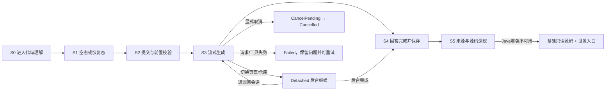

# AI 代码理解开发文档

后续Java增强使用独立的 [JLS-T0～T5开发文档](jdtls-development.md)：T0核心验证已完成，从T1公共LSP客户端与官方JDT插件适配开始，再完成AI/源码视图及按插件ID管理的安装入口。适配器随应用发布、引擎包独立安装。JLS任务不阻塞CU2-T5/T6，也不重启旧版Java/Spring静态分析排期。

版本：2.1。日期：2026-09-13。此计划替代旧 DEV-05～15 的排期，历史结果不删除。

开工先读[交接入口](README.md)、[需求](requirements.md)、[设计](design.md)和根 [AGENTS.md](../../AGENTS.md)。

## 1. 从现有成果直接推进 AI 闭环

不要重新从索引基础设施开始。当前有 schema v3、源码身份/证据/事实、Java 提取和进行中的解析工作；这些保留。先核对能被 agent 使用的最小接口，然后让 AI 真正读一次登录代码。

本轮只更新文档，源码、fixture 和已有 validation 记录未修改。下个实现批次不能把历史构建结果当作本次验收。发现旧分支/未提交实现不稳定时，只修复阻止当前工具安全运行的问题；不以“完成旧语法题库”为名继续扩大静态分析。

## 2. 新任务卡

CU2-T 编号与历史 DEV 区分。没有未经用户要求启动其他 agent；任务卡用于后续接手。

| 编号 | 任务 | 主要范围 | 完成证据 |
| --- | --- | --- | --- |
| CU2-T0 | 复用盘点与最小样例 | 核对索引/identity/types/AI 实际接口，盘点未提交修改 | 一页接口映射、现有测试基线、登录样例设计；不新增 schema |
| CU2-T1 | 六个只读工具 | tools/source；复用搜索、详情、调用追踪；补 XML/SQL 有界检索与读取 | 无 Git 目录可读；来源可校验；缺边能搜索；路径/预算测试 |
| CU2-T2 | 单问题 agent 闭环 | agent；复用 SSE、工具轮次、取消和现有 AI 计数 | 无 UI 输入“登录逻辑怎么实现”，返回真实阅读证据和结果 |
| CU2-T3 | 业务答案与数据读写 | analysis；会话级 DTO、来源校验、提示与边界处理 | 三种登录样例的上下游、读写表/对象、失败分支均准确 |
| CU2-T4 | 追问与生命周期 | 会话摘要、请求代际、取消/切换、旧引用失效 | 追问深入同一逻辑，迟到消息/旧文件不污染结果 |
| CU2-T5 | 简约原生页面 | 问题框、回答、读写表、来源侧栏、步骤简图、后台任务与本地完成历史 | 真数据联动可演示；六种页面状态、深浅主题/窄窗/IME/后台继续/取消重试/历史恢复通过 |
| CU2-T6 | 集成验收与交接 | 工具/模型/性能/原生 UI/旧功能回归 | 实际测试与模型报告、release 零错误零警告、剩余限制 |

依赖顺序：T0 → T1 → T2/T3（同一服务闭环内迭代）→ T4 → T5 → T6。不把所有样例的静态索引精度设为 T2 的先决条件。UI 仍在底层服务可演示之后实施。

## 3. 旧任务如何处理

| 旧任务/资产 | 当前处理 |
| --- | --- |
| DEV-00～04 已有存储、身份、事实、Java 元数据 | 保留并复用；历史验收参考 validation，不重新实现 |
| DEV-05 进行中的调用/类型解析 | 保留现有代码和测试；停止为新首版扩展语句提取、record 等额外语言语义 |
| DEV-06 Spring 静态框架分析 | 从首版排期移除；AI 阅读源码/配置/映射替代专用分析器前置要求 |
| DEV-07 全量语义重算与增量优化 | 不作 AI 闭环前置；只处理会造成当前结果错误或资源不可接受的实际问题 |
| DEV-08 源码读取 | 收入 T1，复用已有 hash/SourceRef，补缺失 reader |
| DEV-09 全面查询重写 | 收入 T1 的必要适配；先测缓存/限额效果，有瓶颈再局部优化 |
| DEV-10 SCC/复杂图布局 | 改为 T5 的少量步骤简图 |
| DEV-11/12 理解 agent/生命周期 | 提前为 T2～T4 的主线 |
| DEV-13/14/15 UI/集成 | 收缩为 T5/T6，不交付全仓库图工作台 |

详细历史与范围取舍见[范围调整记录](scope-change-v2.md)。不因换需求直接删除/回退未提交代码。

## 4. T0 盘点要求

1. 记录 HEAD、git status 与已有未提交修改；已有文件不能被覆盖。
2. 优先使用 codebase-memory-mcp 定位函数；索引未更新时先更新，结果不足才按已知文件补读。
3. 核对 search_symbols、symbol_detail、trace_calls、SourceRef、Analysis 相关 DTO 和 ChatClient；区分“交接里记载”与“当前可运行”。
4. 检查现有严格 AnswerDocument 是否只能引用数据库权威图。保留原验证语义，新会话 AnalysisResult 单独适配，不能把它放宽成“AI 说存在就存在”。
5. 记录当前 Java 全量重建、字段访问体积等已知限制；只有影响本轮工具资源/正确性时才做最小修复。
6. 形成接口映射后直接开始 T1；不要产出另一份泛化索引架构计划。

## 5. 最小测试样例

新增独立的业务样例目录（如 `src/tests/fixtures/code_understanding_business/`），保留旧 J01～J12/S01～S12 与 expected.json 原样。新样例为可分发的手写源码，无需真实数据库、Java 构建或联网依赖。

| 样例 | 应包含的代码 | 验收重点 |
| --- | --- | --- |
| B01 普通 Java 登录 | 调用入口、AuthService、明确 JDBC SQL、成功/失败分支、另一个调用方 | 不依赖 Spring；读用户、更新登录信息、插入尝试记录、直接上下游 |
| B02 Spring + MyBatis 登录 | Controller/认证入口、接口与实现、Mapper XML、条件日志写入、Redis 会话 | AI 从方法读到 XML，再报告表读写；缓存不混为表 |
| B03 Spring + JPA 登录 | Repository 调用、明确 Entity/Table、save/Query、未显式映射对象 | 有映射时推断并引用；无映射时物理表名未知，不编造 SQL |
| B04 检索缺口 | 屏蔽一条索引调用边、XML 无符号节点、多个 login/signIn 入口 | AI 能搜索源码补查并说明范围，不强依赖完整静态图 |
| B05 边界变体 | 动态表名、存储过程/外部认证、无实现接口、条件多实现、复杂 SQL | 未知不编造；CTE/别名不当物理表；保留条件与外部边界 |

标注应直接写“问题→允许入口/调用方/调用/读写对象/条件/来源范围/未知项”，不强制每项对应索引 RelationKind 或数据库行号。标注不能只存模型生成的答案作为 oracle。

每个主样例最少三问：

- “登录逻辑怎么实现的？调用了什么，被什么调用？读写哪些表？”
- “密码错误时会发生什么，会写入什么数据？”
- “谁还调用了这个认证服务？这里的会话怎么创建？”

额外边界问题包括：“最终表名是什么？”“这个分支一定会执行吗？”“SQL 没找到是不是就没有写库？”。

## 6. 关键自动回归

| 测试 | 预期 |
| --- | --- |
| 工具白名单与项目范围 | 无 Git/执行/数据库工具；路径越界、根外链接和排除文件不能读取 |
| 不完整索引 | trace 无边但 search/read 可找到关系；结果明确为 AI 源码分析，不伪造数据库权威边 |
| 来源检查 | 有效来源可打开；伪造 ID、错项目、hash 变化、越界行不能被标有效 |
| 非索引资源 | XML/SQL 可按允许路径检索与阅读；引用实际内容，不要求先有符号节点 |
| 读写分类 | 同表可读写，缓存单列，ORM 标推断，动态名标未知 |
| 结构校验 | 流程节点有来源，连接无悬空端点；sequence_hint 不冒充 call |
| 模型输出与传输 | 正常/空/仅思考/坏 JSON/EOF/length/瞬态失败和配置错误处理符合现有客户端 |
| 预算 | 每个批量工具检查、重复 call_id 防重复执行、上下文/工具/轮数/HTTP 尝试都计数，收尾不绕过限制 |
| 生命周期 | 显式取消、后台分离、离页、切标签/仓库、panic、迟到事件、重试不串结果，AI 名额在任务实际退出后释放 |
| 索引/文件变化 | 不把不同文件版本拼成确定答案；旧引用可解释失效，重新分析可恢复 |

mock SSE 用于可复现协议/状态测试，不能用来证明 AI 真能理解项目。SQL 读写语义等依赖模型的判断同时需要真实模型评估和人工核对。

## 7. 真实模型业务验收

使用同一供应商、模型、提示版本和样例版本，对上述问题至少运行两遍，保留两遍结果，不能只展示最好的一次。

逐问检查五项：

1. **定位**：找到了正确业务入口和核心实现，未把另一个登录方式混入。
2. **链路**：回答了调用方与被调用方，关键关系有源码依据；未声明未知范围为完整结果。
3. **读写**：标注的关键对象/操作/条件无遗漏或错误；推断/未知类别正确。
4. **逻辑**：成功、失败与其他核心副作用说明符合源码，不只罗列名字。
5. **来源**：所有关键行为可回到有效代码，内容真正支持结论。

主样例两次运行都通过关键项，才通过本轮业务验收；失败先改检索路径、上下文和提示。只有重复失败证明缺少特定可复用定位能力时，才补小型工具/索引字段，并记录依据。不得立即扩成静态框架引擎。

旧 40 题语言细节题库仍可用于现有解析器回归，但不是新版问答的主验收门槛。真实模型不可用时标明业务验收未完成，不以 mock 成功替代。

## 8. 性能验证与完成门槛

使用一个有代表性的实际项目（可优先 Khaslana 自身）和一个包含 Java/XML 的业务样例集。记录文件/符号/关系数量、机器、模型、读文件数、总工具数、各阶段耗时与输入量。

- 本地工具受设计预算约束，2s 截止的搜索能返回明确的部分结果；取消时 UI 可立即反馈，工作线程按读取/轮次边界停止。
- 重复 trace 不每次无界加载图；若一次全图载入就超出资源/延迟目标，再针对该路径改直接 SQL。每问最多保留一份缓存快照。
- 不自动遍历并发送全仓库；源码/工具输出/对话历史受统一预算限制。
- 常规登录样例应在 40 次工具预算内完成；达限则保留部分并标原因。记录真实时间，不承诺不受供应商影响的固定秒数。
- UI render 不进行搜索、文件读取、图遍历或网络调用；步骤简图有上限，源码用虚拟列表。

本版不沿用旧“实现完整 Java 语义且达到固定十万符号静态精度”的前置指标，但保留已有索引安全预算和回归。

## 9. 原生 UI 验收

必须检查：输入中文/IME、发送/取消/重试、表读写清单、来源点击、流程节点定位、源码返回、追问范围、切项目/离页、深浅主题、窄窗和长路径。

来源打开采用本地只读 reader，可复用 syntax 和列表 helper，不借道 blame。简图用真实 AnalysisResult，不硬编码演示流程。项目按钮/文本输入/虚拟列表/分隔条遵循 AGENTS.md；不新增图键盘导航。

截图来自实际 GPUI 应用。若当前工具无法操作原生窗口，应记录需人工验收的项，不用 HTML 截图冒充通过。本轮文档调整没有进行任何 UI 验证。

### 9.1 CU2-T5 已确认的页面流程

2026-09-13 用户确认以下三条为 T5 固定规则，后续实现和验收不得退回旧语义：

1. 只有结构有效的完成结果才进入历史。
2. 显式取消不保存流式半截回答。
3. 切换页面、标签或仓库只分离显示，任务继续在后台运行。

这里的“完成结果”包含 `Completed` 和已经明确标出未完成范围、通过结构及来源校验的终态 `Partial`；不包含仍在流式输出的正文、传输截断、坏 JSON、`Failed` 或 `Cancelled`。历史是本地记录，不做云同步、团队分享或跨仓库合并。

主流程固定为：

| 状态 | 进入条件 | 页面内容与动作 | 离开条件 |
| --- | --- | --- | --- |
| S0 进入 | Context Navigator 选择“代码理解” | 沿用当前应用外壳，读取当前仓库、分支、索引和已有任务 | 路由到 S1、S3、Detached 或 S4 |
| S1 空态/恢复态 | 当前仓库没有显示中的任务或答案 | 项目与索引状态、问题框、示例问题、最近完成记录；输入法组合期间 Enter 不发送 | 发送进入 S2；打开记录进入 S4 |
| S2 校验态 | 用户发送非空问题 | 校验仓库、AI 配置、索引可用性和全局 AI 名额；冻结本次路由身份与上下文 | 成功进入 S3；失败留在 S1 并显示可行动提示 |
| S3 生成态 | 任务已取得 AI 名额 | 显示原问题、已完成时间线步骤、当前动作、临时正文、来源数量、后台运行与取消 | 完成进入 S4；切换进入 Detached；错误进入 Failed；取消进入 CancelPending |
| Detached 后台态 | 运行中切换模式、标签或仓库，或点击“后台运行” | 原任务继续；全局状态栏显示 `AI 任务 n/3`，任务条提供查看进度和取消；不把任务内容投到当前仓库页面 | 返回原会话恢复 S3；后台结束进入 S4/Failed/Cancelled 并提示一次 |
| Failed 失败态 | 网络、模型、工具、预算收尾或来源读取失败 | 保留问题与已完成步骤，显示明确错误、复制详情和重试；失败结果不写历史 | 重试创建新代际并进入 S2；编辑问题回 S1 |
| S4 完成态 | 得到结构和来源校验通过的 `Completed` 或终态 `Partial` | 定格摘要、流程、调用上下游、读写、边界和来源；显示“已保存到本地历史”，提供复制、追问和来源入口 | 追问进入 S2；来源进入 S5；打开其他历史仍为 S4 |
| S5 来源态 | 点击来源、流程步骤或读写项 | 宽窗右侧打开基础只读源码；窄窗源码替换回答并提供返回；重复点击只替换当前来源，不堆叠标签页 | 返回恢复回答阅读位置；“解释此处”形成携带选中范围的新问题 |

### 9.2 异常与降级规则

| 分支 | 用户可见行为 | 恢复路径 |
| --- | --- | --- |
| 未打开仓库 | 问题框不可发送，正文区只显示“打开仓库”主动作 | 打开成功后回 S1，不丢输入草稿 |
| 没有索引 | 允许保留问题并引导建立基础索引；不得把“Java 深度分析”设为前置条件 | 索引完成后重新执行 S2，不自动发起 AI 请求 |
| 索引已停用但有数据 | 允许基于现有数据提问，显式显示可能过期，并提供“启用并更新” | 用户自行决定是否更新；不静默改变上下文 |
| AI 未配置或配置错误 | 保留问题，提供设置入口；400/404/422 等配置错误不做无意义重试 | 返回页面后重新校验配置 |
| 瞬态网络或读取失败 | 保留问题、已完成步骤和已读来源，错误卡提供重试 | 重试前重新校验当前索引/文件；未变化时复用原范围，变化时建立新快照并提示 |
| 达到预算 | 只有产生结构有效、明确说明未查完范围的 `Partial` 才可作为完成结果保存 | 用户可基于该结果继续追问；没有有效结构则按 Failed 处理 |
| 来源过期 | 已保存回答可读，但来源按钮显示失效，不按旧行号打开新内容 | 提供“重新分析”而不是悄悄替换证据 |
| Java 语义不可用 | 普通只读源码继续可用；定义/实现/引用/调用动作禁用并说明未安装、未启用或未就绪 | 提供“前往语言支持”，返回后刷新能力状态 |

### 9.3 生命周期与当前 T4 实现差异

T4 的 `UnderstandingSession::detach_active()` 当前会设置取消标志并拒收后续事件，符合旧“离页即取消”语义，但不能用于本节确认的普通页面/仓库切换。T5 接线必须拆开两种动作：

- **显示分离**：只解除当前页面与任务的可见绑定，任务注册表继续按项目键、标签会话键和请求代际接收进度与终态事件；不得设置取消标志。
- **显式取消**：继续调用取消路径并进入 `CancelPending`，在工作线程真正返回 `Cancelled` 前保持 active 和 AI 名额，不允许同仓库新请求越过旧任务。

在 `RepositoryView` 内只保存当前可见投影会导致切仓库后丢失后台事件，因此 T5 需要一个独立于当前主模式的理解任务注册表。首版约束为同仓库最多一个在途理解任务，全局仍与 AI 评审/一次性生成共享最多 3 个 AI 任务；切到另一个仓库后可在全局名额允许时开始该仓库的任务。

所有 UI 事件先以 `(project_key, session_key, generation)` 路由到注册表，再决定是否刷新当前页面、只更新后台任务条或仅完成持久化。旧代际、错误项目或错误会话事件直接丢弃并记调试日志，不能改变当前问题、来源栏或状态栏计数。

### 9.4 本地完成历史

T4 的会话内最近 5 次答案、最近 3 次摘要和 8K 字符提示预算保持不变；它们负责追问上下文。T5 另加只读的本地完成历史，负责跨页面和应用重启恢复，两者不能混成无界模型历史。

本地记录至少保存：格式版本、仓库键、会话键、问题、完成状态、`AnalysisResult`、已校验来源、模型标识、开始/完成时间和当时的索引代际。不得保存 API Key、原始系统提示、完整工具调用参数、未收尾的流式缓冲或不必要的源码全文。

存储约定复用现有 AI 评审记录的仓库隔离与坏文件跳过方式：每仓库保留最近 30 条完成记录，历史弹窗首屏列最近 20 条；写入采用临时文件加原子替换，写入失败只提示保存失败，不把已经完成的回答改成请求失败。读取坏文件时跳过并记录警告，不阻断其他历史。

后台任务完成时先让任务进入终态并释放许可，再写历史和发送一次 toast。历史重新打开默认恢复回答滚动位置；若记录了最后来源，可恢复来源选择但允许立即关闭。每次点击历史来源仍走 `validate_history_source`，文件或索引变化后显示失效状态。

### 9.5 页面布局与控件契约

- 应用标题栏、Context Navigator、仓库切换器和底部状态栏保持现状；新增 `MainMode::CodeUnderstanding` 只替换中央工作区，不重排现有主界面。
- 页面使用现有 Calm Technical token：平面分区、`BORDER_MUTED` 分隔、选中项浅主题色和 2px 指示条；不使用渐变、玻璃、悬浮卡堆叠或桌面外圈淡蓝边框。
- 宽窗来源侧栏默认 336px，可由现有 splitter 调整到 280～480px；回答可用宽度不足 720px 时，源码替换回答主区并显示“返回回答”。
- 问题框复用多行输入组件：Enter 发送、Shift+Enter 换行；IME composing 时 Enter 只确认候选，不发送。运行中问题只读，允许复制。
- 时间线只显示面向用户的“查找、阅读、核对、组织回答”等动作，不显示工具 JSON、系统提示或模型内部推理。新 delta 追加时不得把已有区块整体回弹。
- 完成回答顺序固定为：摘要/业务流程 → 调用上下游 → 数据读写 → 其他副作用与未知项 → 来源。步骤最多 15、连接最多 20；超限信息留在文字结论并提示聚焦。
- Java 语义按钮只在能力为 Ready 时出现可操作态；基础源码查看不依赖 JDT LS，插件未安装或项目增强关闭不能让全部来源失效。

### 9.6 T5 开发切片与验收矩阵

按以下顺序实施，避免先画完整页面再补生命周期：

1. 增加主模式入口、S1 空态和当前仓库/索引投影。
2. 接入独立任务注册表、S2/S3、共享 AI 名额、后台分离与 CancelPending。
3. 用真实 `AnalysisResult` 渲染回答、步骤和读写表，不硬编码演示数据。
4. 接入基础来源侧栏、宽窄布局、来源复验和阅读位置恢复。
5. 增加本地完成历史、后台完成提示、坏记录与保存失败处理。
6. 预留 Java Ready 能力动作与降级入口；JLS-T3 在此接口上继续，不另建第二个源码页面。

| 场景 | 必须验证 |
| --- | --- |
| 正常完成 | 实时步骤、最终结构、来源、完成历史和 AI 名额均正确 |
| 明确 Partial | 有未完成范围和有效来源，可保存并继续追问；无有效结构时不能保存 |
| 显式取消 | 立即进入 CancelPending，任务退出前不释放名额，退出后无历史记录 |
| 切模式/标签/仓库 | 任务继续，当前页面不串内容，状态栏可返回/取消，后台完成只提示一次 |
| 失败与重试 | 问题和完成步骤保留；新代际不接收旧事件；失败不写历史 |
| 文件/索引变化 | 旧回答可读，旧来源失效；重试创建新快照，不混合两代证据 |
| 关闭/重开应用 | 只恢复完成历史，不恢复已中断的流式任务；坏记录不阻断启动 |
| 深浅主题/窄窗/长路径 | 无裁切、穿透或横向挤坏；源码替换回答后可回到原阅读位置 |
| IME 与键盘 | 中文候选确认不误发送；Enter/Shift+Enter 与按钮行为一致 |
| Java 未就绪 | 基础源码可读，语义动作不可用原因明确，设置返回后能力可刷新 |

## 10. 构建、需求映射与交接

测试代码按现有 `src/tests/` 外移惯例组织。实施批次先运行受影响工具/AI/状态测试，再跑相关索引回归；最终运行库/主程序测试与仓库规定的 `cargo build --release`，零错误零警告。过滤测试必须检查实际执行数，0 tests 不算验收。仅本轮文档修改不需要 Rust 构建。

| 需求 | 对应任务 | 验证 |
| --- | --- | --- |
| CU2-R1 | T1/T2/T3 | B01～B03 主问题 |
| CU2-R2 | T1/T2/T3 | B01 的另一个调用方、B04 缺边 |
| CU2-R3 | T1/T3 | B01～B03 数据读写、B05 动态/复杂 SQL |
| CU2-R4 | T2/T3 | 成功/密码错误及其他副作用问题 |
| CU2-R5 | T1/T3/T4 | 来源校验、人工逐项内容核对 |
| CU2-R6 | T4/T5 | 追问、步骤/源码联动 |
| CU2-R7 | T5/T6 | 原生 UI 状态与布局矩阵 |
| CU2-R8 | T1/T2/T4/T6 | 范围/预算/取消/旧结果回归 |

每批交接写明：任务号、实际修改、复用接口、测试命令与数量、构建结果、真实模型用例与失败项、已知限制、下一项任务。旧代码成果保留与新功能是否通过必须分别描述。

T0～T4 服务层交接见 [validation/](validation/) 下对应文件；T2/T3 用脚本化模型驱动真实
索引与源码工具，T4 覆盖追问历史、请求路由、取消/分离与旧来源复验。B01～B05 真实模型
业务验收（§7）已全部完成：五个样例各两遍均通过关键项（B04 检索缺口两遍均靠文本搜索
补齐反射入口；B05 动态表名/存储过程/无实现接口/条件多实现/CTE 全部如实标注、零编造），
报告见 [validation/cu2-t3-live-acceptance.md](validation/cu2-t3-live-acceptance.md) 与
`validation/live-runs/`（十份报告）。

**下一项工作是 T5 原生页面（用户已确认 T4 不在本阶段展开追问验收）。**
