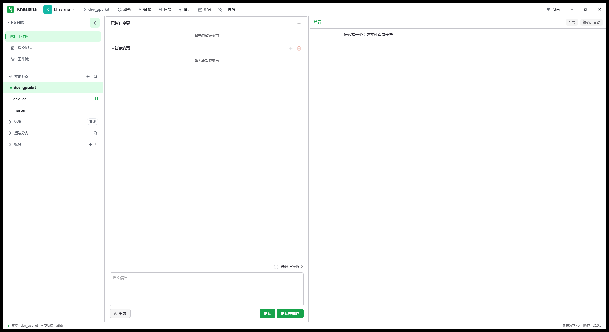
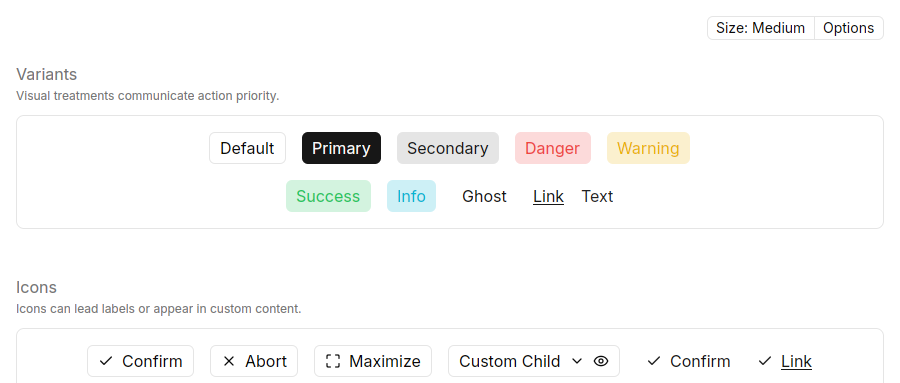
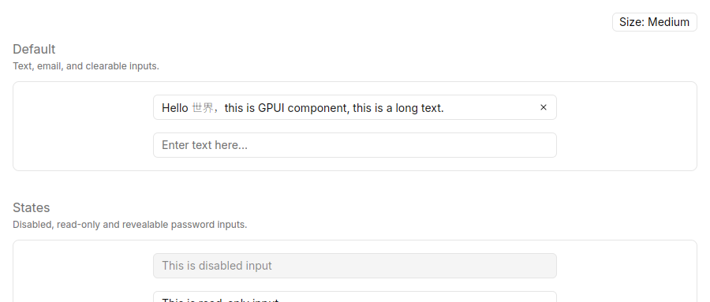
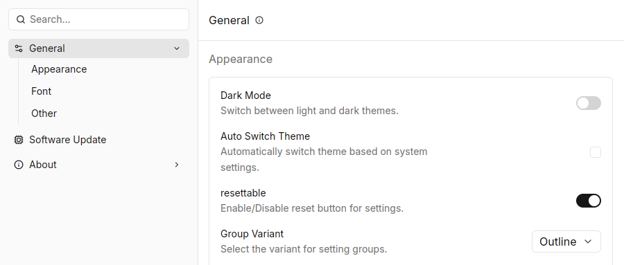
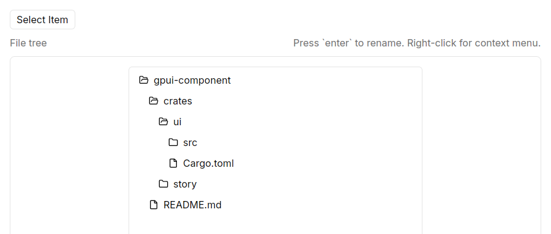

# GPUI Kit 组件与迁移调研

调研日期：2026-09-20。项目基线：`dev_gpuikit`，提交 `b4ec8914139ba768f7a6596e3f870173869eabfb`，Cargo 版本 `2.0.1-beta.1`。

执行计划见 [gpui-kit-refactor-plan.md](gpui-kit-refactor-plan.md)。本文记录事实、截图和限制，不表示迁移已经实现。

后续设计决定：用户已提供“漂浮在桌面上的轻量实体”风格参考，见 [视觉规范](gpui-kit-visual-spec.md)。下文的组件调查结论保留，初版视觉建议以新规范为准。

## 1. 结论

建议将前端统一到 **Longbridge GPUI Kit 的 styled component 层**，并把视觉重构作为单独的交付目标。最终删除 `yororen_ui` 和直接使用的 `gpui-ce`，通用控件采用 Kit，Git 专业画布运行在 Kit 导出的 GPUI 上。

这不是四个 import 的替换：当前多数 UI 为 GPUI 自绘，按钮、输入、滚动、弹层和专业画布都需要迁移或适配。也不必为了使用组件库，把 Git 差异行、提交泳道、冲突连线强行塞进通用 Table 或 Editor。

推荐先验证底层与中文输入，再依次迁移基础组件、设置表单、壳层与工作区、其他专业页面。不要先做全自由拖拽 Dock、插件系统或替换 Git/AI/索引服务。

## 2. 组件库与版本核实

| 项目 | 本次核实结果 | 对 Khaslana 的影响 |
| --- | --- | --- |
| 目标项目 | `longbridge/gpui-kit` | GPUI Component 是其中的有样式组件层，不是另一个备选库 |
| 调研版本 | `gpui-kit 0.6.4`，官方发布于 2026-09-18 | 建议原型精确锁定该版本；实施时重新核实，不追随 main 浮动 |
| 分层 | Kit 门面 → `gpui-component` / `gpui-base` → GPUI | 业务页面使用 component；仅特殊交互下沉 base / GPUI |
| 底层 | v0.6.4 workspace 使用 `gpui-pre 0.3.5` 与匹配的平台/宏包 | 与现有 `gpui-ce 0.3.3` 不是同一个 crate，类型不能直接互传 |
| 默认 feature | Kit 默认 `component`、`assets` | 不需要引入 `gpui-shell` 或 JavaScript |
| 可选语法依赖 | component 的 tree-sitter 为可选 `0.26.13` | 本项目索引使用 `0.25.10`，首轮不启用 Kit tree-sitter features |
| 当前锁定依赖 | `gpui-ce 0.3.3`、`yororen_ui 0.2.0` | 不要把包名都含 GPUI 当作源码兼容保证 |

依据：[官方 v0.6.4 发布](https://github.com/longbridge/gpui-kit/releases/tag/v0.6.4)、[固定 tag 的 workspace 配置](https://github.com/longbridge/gpui-kit/blob/v0.6.4/Cargo.toml)、[Kit 配置](https://github.com/longbridge/gpui-kit/blob/v0.6.4/crates/kit/Cargo.toml)、[component 配置](https://github.com/longbridge/gpui-kit/blob/v0.6.4/crates/component/Cargo.toml)。上述配置本次也直接读取了原始文件。精确依赖可解析性和编译兼容性仍需原型验证。

**重要区别：**升级底层是一次统一切换；组件外观可以在切换之后逐页迁移。不能把旧 Yororen 控件与新 Kit 控件直接放进同一个 GPUI 元素树作为“渐进迁移”。保留下来的旧自绘元素也必须先适配到同一底层。

## 3. 实际看到的效果

### 3.1 当前项目：工作区空状态

本次通过 Windows 窗口截图捕获并打开检查。运行程序为 `D:\khaslana\khaslana.exe`，截图右下角版本为 `v2.0.0`，**不是当前源码编译产物**；仅作为正在使用的界面视觉参考，不能据此认定当前分支所有页面都具有相同问题。

观察范围只有当前工作区空状态，没有执行暂存、提交、推送等操作。

| 编号 | 观察 | 判断与建议 |
| --- | --- | --- |
| V1 | 左导航、变更区和差异区的职责能辨认，主题色选中态明确 | 保留工作台式信息架构，不增加一层重复导航 |
| V2 | 空变更时中间列仍占较大宽度，右侧空白提示贴近顶部 | 为无仓库、无变更、未选文件分别设计空状态；调整默认列宽，保留用户拖拽偏好 |
| V3 | 标题栏命令、列表辅助信息和底部状态文字整体偏小 | 先验证 13px 正文候选与中文基线；元信息可较小，但不让主要操作依赖 11px 文字 |
| V4 | “提交”和“提交并推送”使用同等强调色；截图同时显示无暂存变更 | 建议提交为主要动作、提交并推送为次要动作；禁用是否正确需运行交互验证，不能仅凭截图判错 |
| V5 | 页面大多使用白底和细分隔线 | 适当区分导航底、内容底与编辑区，减少同层边框竞争，避免增加装饰卡片 |

截图无法证明对比度合规、输入法行为、焦点路径或性能；这些进入实施验收。当前没有完成全产品 UX 审计。

### 3.2 官方按钮：层级与状态比统一自绘按钮更完整

截图来自 [官方 Button 画廊](https://gpui-kit.com/gallery?story=Button)。本次实见 default、primary、secondary、danger、warning、success、info、ghost、link、text 和图标组合。可用来明确提交、普通操作和危险操作的优先级。画廊中的示例配色不直接作为产品最终配色。

来源：[Button 文档](https://gpui-kit.com/component/button)、[v0.6.4 Button 实现](https://github.com/longbridge/gpui-kit/blob/v0.6.4/crates/component/src/button/button.rs)。

### 3.3 官方输入：清空入口和禁用态

截图来自 [官方 Input 画廊](https://gpui-kit.com/gallery?story=Input)。实见中文和英文混排、清空按钮、placeholder、禁用样式。**看到中文字符不等于验证了 Windows IME。**单行使用 `Input` / `InputState`，普通多行使用 `Textarea` / `TextareaState`；不要照旧版教程把所有输入都当作同一种状态。

来源：[Input 文档](https://gpui-kit.com/component/input)、[Textarea 文档](https://gpui-kit.com/component/textarea)、[v0.6.4 输入模块公开导出](https://github.com/longbridge/gpui-kit/blob/v0.6.4/crates/component/src/input/mod.rs)。

### 3.4 官方设置：最适合作为首个迁移页面

截图来自 [官方 Settings 画廊](https://gpui-kit.com/gallery?story=Settings)。实见分类导航、设置分组、名称与解释文案、右侧开关和选择框。它与本项目的设置中心形态接近，能先验证主题、输入、开关和菜单的一致性。

这里借鉴行布局和控件组合，不直接采用官方示例的所有搜索/自动保存行为。Khaslana 各设置项当前的立即生效、保存、测试、取消语义必须逐项保留。[Settings 文档](https://gpui-kit.com/component/settings)

### 3.5 官方树：清晰的层级和图标

截图来自 [官方 Tree 画廊](https://gpui-kit.com/gallery?story=Tree)。实见目录层级、缩进和文件图标，适合评估分支浏览文件树。示例提示 Enter 重命名，说明不能直接假定它符合本项目现有键盘白名单；只读浏览也不能顺带开放文件重命名。[Tree 文档](https://gpui-kit.com/component/tree)

### 3.6 视觉证据限制

- 四张官方截图是网站当日运行的 **Rust/WASM 画廊可见区域**，不是本机 Windows 原生组件测试，也未核实部署 build 与 v0.6.4 完全一致。
- 画廊首次加载约 40MB WASM，用时约 4.5 分钟；加载页截图已排除。不能拿网络加载时间推断原生启动性能。
- 本次查看的是静态呈现，没有验证所有 hover、点击、滚动、暗色、IME 与辅助技术行为。
- 调研时未生成 Khaslana 新版效果稿；用户随后已指定风格参考，见新增视觉规范。本文的官方组件截图仍仅为能力证据，不是未来产品截图。

## 4. 当前源码盘点

按当前分支实际文件统计：87 个非测试 Rust 文件；35 个文件包含 `gpui::`，这些文件合计 46,461 行（包含业务逻辑，**不是需要重写的 UI 行数**）。直接引用 `yororen_ui` 的生产文件只有下面四个。

| 文件 | 已核实的接入点 | 迁移事项 |
| --- | --- | --- |
| `src/main.rs` | 初始化、中文 locale、全局主题、标签推送远端 Select | 改 Kit 初始化、Root 和浮层；替换 Select；保持 MCP 无头入口优先 |
| `src/assets.rs` | AppAssets 合并应用资源与 Yororen UiAsset | 合并 Kit 默认资源与应用资源，检查图标路径碰撞 |
| `src/theme_view.rs` | GlobalTheme、ThemeSet、色板桥接 | 改为 Kit Theme 适配，保留用户主题/强调色偏好与高亮刷新 |
| `src/remote_branch_operation.rs` | Select、Icon、动画常量、ActiveTheme | 迁移拉取/推送/upstream 弹窗中的控件与动画 |

其他关键范围：

| 文件/符号 | 当前情况 | 为什么影响计划 |
| --- | --- | --- |
| `src/main.rs` | 18,941 行；RepositoryView、RepoTabState、FieldId、事件处理、菜单、设置与弹窗仍集中其中 | 不可根据旧图谱误以为事件/弹窗已拆出；只随迁移抽取 UI 方法 |
| `src/ui/components.rs::app_button_with_click_event` | 基于 div，自带启用守卫、操作后的错误/成功反馈和 notify | 换成 Button 时不能丢这些副作用，也不能与新通知重复弹两次 |
| `src/ui/theme.rs` | 678 行，语义 token、深浅色与强调色 | 保留语义身份，建立到 Kit 主题的单向映射，避免双主题不一致 |
| `src/text_input.rs` | 1,169 行，自绘单/多行元素、文本状态、UTF-16 与光标逻辑 | 输入迁移是状态模型替换，远不止改边框 |
| `src/ui_helpers.rs` | 1,165 行，含自绘双向滚动条与 uniform_list 适配 | ScrollHandle、长行宽度测量、滚动同步需验证 |
| `src/main.rs::render_virtual_diff` | 核心差异渲染在 main.rs，使用虚拟列表与横向宽度测量 | `diff_view.rs` 仅 112 行，主要负责全文开关；不能把它当整个 diff 实现 |
| `src/main.rs::render` | 主模式路由、根层捕获、菜单、设置、对话框、AI、blocker 与反馈挂载 | Root 和新浮层必须一次梳理，防点击穿透或重复关闭 |
| `src/workflow_editor.rs` | 4,236 行，分步编辑器与动态字段 | 单独迁移动态字段生命周期，稳定 ID 与订阅不能按 render 重建 |
| `src/chrome_view.rs` / `src/tray.rs` | 自定义标题栏、860×520 最小窗、原生 WindowControlArea / HWND | 桌面行为是底层切换的前置验收项 |

定位行号（仅对应本次基线）：`main` 在 main.rs:18846；根 render 在 17710；设置中心在 13205；对话框分派在 15026；虚拟 diff 在 14405；按钮适配在 components.rs:1300。

### 代码证据可靠性

按项目约定先使用 codebase-memory 图谱，采用 Verify 范围验证。初始图谱 generation 为 `2026-09-20T05:34:21Z`，包含本分支不存在的 `repository_ui.rs`、`dialog_view.rs`、`code_navigation/` 等路径；main 的旧行号也错位。随后刷新索引并重新查询，根 render 的出向一层查询返回 57 个可达节点、无分页截断。

覆盖工具仍对相关文件报告 metadata_changed，并保留旧 scope 信息，因此没有把“索引完成”当作全量证据。以上文件职责、依赖引用、关键函数位置及统计均使用当前磁盘源码补查；不存在的旧路径不列入实施范围。调用图包含启发式同名边，不据其推断精确业务依赖。

## 5. 组件对应与采用判断

以下“采用”是计划判断，不是已完成兼容验证。

| 当前实现 | Kit 候选 | 采用判断 / 必须保留的语义 |
| --- | --- | --- |
| button / primary_button / danger_button / toolbar | Button、ButtonGroup、Icon、Tooltip | 优先；稳定业务 ID、禁用说明、危险确认、反馈副作用 |
| toggle_box / code_index_switch | Checkbox / Switch | 选择与即时开关分别使用；索引按 repo_key 寻址 |
| 手绘分段按钮 | Toggle / Tabs | 仅承接已有模式，不增加第二套导航 |
| 单行与多行文本框 | Input / Textarea / Form | 高收益高风险；保留字段验证、secret、Enter 语义、仓库草稿 |
| Yororen Select 与手绘菜单 | Select / Combobox / PopupMenu / Popover | 远端、编码、分支选择；超大分支集要验证过滤与虚拟化 |
| 手绘弹窗与 toast | Dialog / Notification | 统一宿主、层级、关闭策略和通知队列 |
| 设置页外壳 | Settings 或 Sidebar + Form + 自有布局 | 优先迁移主题页/代理页；复杂列表不用硬塞通用设置行 |
| 分栏拖拽 | Resizable | 优先固定分栏；不默认启用任意拖拽 Dock |
| 导航树 / 变更 / 历史列表 | Sidebar / Tree / List / VirtualList | 行内容保留领域模型；是否替换 uniform_list 由性能与行为验证决定 |
| 提交拓扑 / diff / blame / 冲突连线 | Kit 导出的 GPUI canvas + 虚拟行 | 保留定制绘制，统一主题与周围控件；不声称 Kit 有 GitDiff/CommitGraph 成品 |
| AI 评审 Markdown | TextView，必要时保留自有 parser/render adapter | 流式半截 Markdown、滚动跟随、复制完整结论和链接策略要一致 |
| AI 思考窗口 / 工作流进度 | Dialog、Progress、Spinner、Collapsible | 固定高度、有界滚动、后台运行与取消分开，任务代际仍归业务层 |
| 元信息与空状态 | Tag / Badge / Empty / DescriptionList | 简化视觉层级，状态同时有文字，不只靠颜色 |

能力依据：[组件目录](https://gpui-kit.com/component)、[Resizable](https://gpui-kit.com/component/resizable)、[VirtualList](https://gpui-kit.com/component/virtual-list)、[Dialog](https://gpui-kit.com/component/dialog)、[Notification](https://gpui-kit.com/component/notification)、[TextView](https://gpui-kit.com/component/text-view)。

## 6. 必须先解决的兼容点

1. **底层类型统一。**Kit、旧 gpui-ce 的 Entity、Window、Context、Element/Render 等不能跨 crate 混用。先在隔离工程验证，再统一换底层。不要通过同时保留两套 GUI 库来跨类型拼接。
2. **键盘策略有明确冲突。**AGENTS.md §8 要求普通控件无 track_focus/tab_index、无键盘激活。v0.6.4 Button 默认 tab_stop=true，源码仍挂 track_focus；`tab_stop(false)` 与 `focus_ring(false)` 只解决部分行为，不能宣称符合严格规则。已向用户提出保留白名单还是接受标准键盘交互的问题；答复前，相关实施门禁保持待决。
3. **Root 不等于浮层自动迁好。**需要 `gpui_kit::init`、每窗 Root，以及实际使用的 dialog/sheet/notification layer。原有 credential、blocker、AI overlay 的顺序与事件捕获要明确定义；订阅必须存活。[初始化说明](https://gpui-kit.com/docs/getting-started)
4. **输入状态变化。**现有 FieldId 由 RepositoryView 持有文本状态；Kit 使用持久 Entity。需要字段适配器、订阅清理、程序回填防循环、仓库切换草稿隔离，以及中文 IME 回归。不得 render 时重新创建 Entity。
5. **tree-sitter feature 冲突风险。**当前 0.25 与 Kit 可选 0.26 涉及同一原生库 links 约束；不默认启用 Kit tree-sitter。日后若必须用其语法能力，再单独验证统一 runtime 对代码索引的影响，不能顺手升级整个索引引擎。
6. **专业画布不是普通列表。**横向滚动、按行/块暂存、Office 文本化二进制 diff、编码切换、冲突连接线和同步滚动必须保留。Kit 的通用虚拟列表能力不能替代这些业务语义。
7. **业务行为留在业务层。**按钮点击与通知、设置保存、任务取消、AI 后台继续、Keyring 等不由组件库接管。

## 7. 调研状态

- 已完成：当前分支源码盘点、依赖/公开 API 核实、当前窗口视觉取样、四个官方画廊的可见效果取样、组件映射和计划。
- 未完成：原生 Kit 编译和链接、应用改造、Windows IME/DPI/托盘验证、真实性能测量、暗色全流程审查、新版设计稿。
- 仅新增本文、计划和已检查截图；未修改 Rust、Cargo.toml、Cargo.lock、现有设计规范及业务数据。
