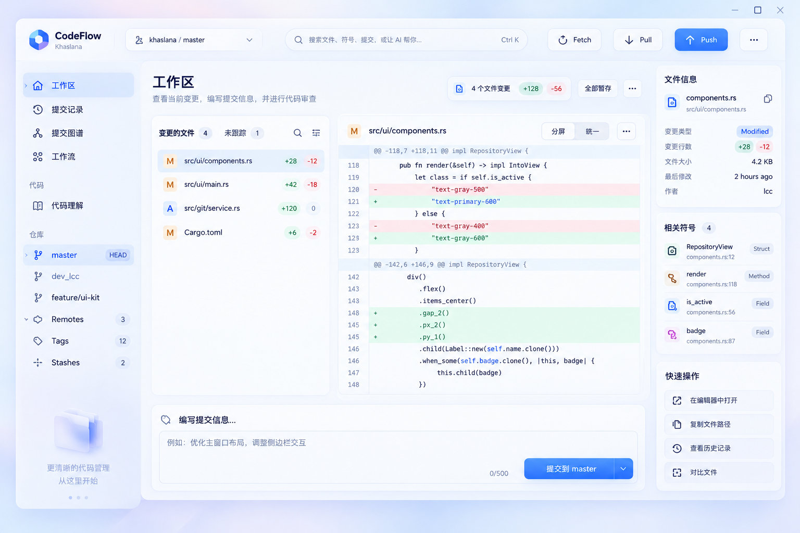

# Khaslana GPUI Kit 视觉规范：轻盈悬浮工作台

日期：2026-09-20。状态：用户已指定风格参考，原生实现待验证。

本规范补充 [重构计划](gpui-kit-refactor-plan.md)，以用户提供的图片和“漂浮在桌面上的轻量实体，减少传统 IDE 的大量分割线和矩形边框”为设计依据。仅采用图片的视觉语言；图片中的文字、代码、品牌和功能示意不构成新增需求。

## 1. 已确定的设计方向

采用低饱和冷色环境底、柔和白色面板、较大的圆角、低对比轮廓、细腻阴影与清晰的蓝色强调，让工作区像一组摆放整齐的轻薄实体。

视觉方向已选定，不再要求用户从三个无关方案中重新选择。后续样板用于验证原生实现、阅读密度与不同窗口大小，不重新决定整体风格。

这项新要求覆盖旧设计规范及旧计划中的“面板必须平面化”“阴影仅用于浮层”“不允许装饰渐变”的限制，覆盖范围仅限本次视觉重构。视觉要求本身不改变业务行为、任务生命周期和危险操作确认；键盘策略另按 2026-09-21 已确认的 Kit 标准交互执行，保留应用快捷键与业务语义。实施时同步更新原有规范，避免新旧规则并存。

## 2. 参考图拆解

图片尺寸为 1536×1024。以下为视觉观察和初始设计取值，不是声称已经测得原设计 token。

| 区域 | 参考图特征 | Khaslana 的落地原则 |
| --- | --- | --- |
| 环境底 | 很浅的蓝紫色过渡，大面积低对比 | 只在应用背景承担氛围，不进入代码行或正文背景 |
| 顶部工具区 | 一条柔和、连续的区域，按钮各有轮廓和厚度 | 保留仓库、分支和已有命令；控制组间用留白分隔 |
| 左导航 | 半透明般的浅面，整行选中底色，较宽留白 | 导航作为独立表面；普通条目不逐行画边框 |
| 文件列表 | 独立圆角面板，标题/计数/筛选同层，行背景轻 | 文件状态标记、路径和增删数字分清主次；保留 Git 列表语义 |
| 差异面板 | 外部圆角，内部代码平整，红绿行背景很浅 | 外部有悬浮感，代码内部不堆卡片或阴影 |
| 提交区 | 独立横向面板，输入区柔和内凹，主按钮突出 | 与变更和 diff 形成一个完整任务区域，保留提交/amend/AI 行为 |
| 右侧信息 | 数个轻薄信息卡，按内容分组 | 作为可选布局参考；不直接照搬“相关符号”等本分支未提供的能力 |

参考图包含圆角卡片，但不是“每个东西都套一层卡片”。文件列表、diff、提交区是主要实体；行、标题和说明是实体内部内容。避免卡片套卡片、每行一个阴影造成的杂乱。

## 3. 表面、深度与颜色

### 3.1 深度层级

建议建立语义化表面和 elevation token，深浅主题分别配置，不在业务 view 散写阴影。

| 层级 | 用途 | 初始浅色样板参数 |
| --- | --- | --- |
| 环境底 | 应用内部背景 | 近白冷蓝；边缘可有极淡蓝紫静态过渡，无投影 |
| 工作面板 | 导航、文件列表、diff 外壳、提交区 | 近白表面；圆角 14–18px；阴影向下约 4px、模糊约 18–24px、冷色低透明度 4%–7% |
| 控件实体 | 普通按钮、选择触发器、输入框 | 圆角 8–12px；按钮可有 1px 接触阴影；输入框以内外明度差表达边界 |
| 临时浮层 | 菜单、popover、dialog、toast | 比工作面板更强的柔和投影；圆角 12–18px；遮罩不过暗 |

数值必须通过原生截图调整：GPUI 阴影半径与设计工具的视觉感受不一定相同。相邻面板阴影不能污染代码、文字或滚动条，也不能被父容器裁切。

“漂浮在桌面上”首先是一种视觉感受，不默认启用系统级透明窗、桌面穿透或实时背景模糊。优先在正常原生窗口内完成相同的轻盈效果；真实透明/模糊只有在 Windows、DPI 和性能验证后才考虑。

### 3.2 色彩候选

- 环境底：以 `#F2F6FF` 附近的冷白为起点，边缘少量 `#E8EFFF` / `#EEEAFE` 氛围色。
- 面板：`#FFFFFF` / `#FAFCFF` 附近，尽量维持文字所在区域的稳定明度。
- 正文：深蓝灰，候选 `#172447`；辅助文字候选 `#64759A`，实际对比度须测量。
- 默认蓝色强调候选 `#3478F6`，选中底色为很浅的蓝；已有用户强调色偏好继续有效。
- 增删内容保持浅绿/浅红背景加清晰的文字和 `+/-` 标识；不把品牌蓝用于表示 Git 成功或失败。
- 边框仅作弱轮廓：必要时 1px 低对比冷灰蓝。面板相邻处不同时画两条分隔线。

允许参考图式的轻微背景过渡和主按钮明暗变化，但不采用高饱和渐变、强烈玻璃反光、发光描边或大面积模糊代码内容。若需要静态背景素材，优先独立资源；不把整个参考图作为应用背景或烘焙成不可交互界面。

### 3.3 暗色主题

浅色先对齐参考。暗色使用深蓝灰环境底、稍亮的工作面板和很轻的轮廓光表达层次，降低黑色阴影依赖。保留相同布局与圆角，避免直接反相成高亮蓝紫霓虹效果。代码红绿背景、正文与禁用态单独验收。

## 4. 组件外观与反馈

| 组件 | 默认表现 | 交互反馈 |
| --- | --- | --- |
| 主要按钮 | 蓝色实面、柔和投影、清晰文字 | hover 略提亮；按下阴影收短，表达“压下” |
| 普通按钮 | 白/浅冷色薄实体、弱轮廓 | hover 改表面明度；不突然出现粗边框 |
| 图标按钮 | 轻底或透明底，点击区域稳定 | hover 浮出浅底；有标签 tooltip |
| 输入框 | 浅面轻内凹，明确编辑边界 | 编辑焦点柔和强调边，错误独立提示，不靠剧烈发光 |
| Switch / Checkbox | Kit 组件统一颜色与尺度 | 只用短暂过渡；选中状态清楚，禁用原因可解释 |
| 列表行 | 默认无边框、无阴影 | hover 薄底，选中浅色圆角底；必要时保留细小指示 |
| 状态标签 | 浅色小标签、轻量计数 | 同一语义颜色一致，不全部使用高饱和色 |
| 分栏拖拽 | 以面板间空隙作为命中区 | hover/拖动时出现细提示线，默认不画贯穿页面的强分割线 |
| 菜单/对话框 | 轻薄实体，明晰表面与阴影 | 遮罩/焦点/关闭路径遵循业务和已选键盘规则 |

悬浮感不等于元素不断移动。hover 不改变布局尺寸；按压优先用颜色/阴影变化。必要的局部位移不超过约 1px，并避免代码区与列表文字跳动。反馈过渡目标 120–180ms；不添加循环漂浮动画。

## 5. 布局和阅读密度

- 面板间距初始 12–16px，面板内边距 12–20px，沿用 4px 基线。以留白分组替代水平线逐项切割。
- 表单正文优先验证 13–14px；元信息 11–12px；主页面标题可用 22–26px，但不能在每个小区域重复大标题。
- 普通表单控件初始 32–36px；顶栏按最新 Pencil 稿为 60px，控件 32–36px。仓库下拉仅显示仓库名，右侧命令使用中文；设置位于侧栏底部。窗口按钮为 32px、间距 2px、右边距 12px。
- 历史/图谱仍按现有 48px 双行布局验证；代码行保持等宽、紧凑和稳定，不为了“松软”丢失行号对齐。
- Diff 的 gutter、hunk 与新增/删除背景可以保留功能性分隔；主布局不要用粗直线从上贯穿到底。
- 先实现左导航、变更列表、diff、提交区。右侧信息栏仅在已有真实数据和行为支持时纳入，并能收起；窄窗先收起辅助信息，保证 diff 宽度。
- 最小窗 860×520 和现有宽度策略仍是约束：缩小外边距/面板间距、折叠导航、减少说明文字，不把主操作挤出窗口。
- 参考图的 window controls 位置不替代 Windows 原生命中与拖动行为；保留托盘、窗口控制和应用命令可达性。

## 6. Kit 接入策略

采用 Kit 组件行为和语义主题，在项目薄适配层统一工作面板、控件表面、圆角、阴影、内边距与状态。先验证公开样式 API 能覆盖哪些部分，再决定局部适配；不把“Kit 默认主题”直接当作参考图效果。

建议新增的视觉封装职责：

- `workbench_surface`：环境底、页面内边距和内容约束。
- `floating_panel`：统一面板圆角、低对比轮廓、投影与内部裁切；让外部阴影与内部滚动区分别处理。
- `control_surface`：控件深度、尺寸和交互状态映射；普通输入仍复用 Kit 编辑状态。
- `panel_gap_splitter`：面板间的稳定拖拽区域与 hover 指示，连接已有尺寸持久化。

以上为职责名称，不承诺当前 Kit 有同名 API，也不要求立刻新增全部模块。优先合并到已有 `ui/` 适配层，避免多一套平行样式系统。

专业画布仍保留自绘：图谱线、diff 行、冲突连接线及虚拟列表必须与新表面兼容；它们的行内容不逐行增加模糊阴影。阴影主要按面板数量增长，不能按文件数或代码行数增长。

## 7. 范围保护

- 品牌仍是 Khaslana，保留现有 logo；图中的 CodeFlow 名称与图标不直接替换品牌。
- 图中的“代码理解”“相关符号”“AI 全局搜索”“分屏 diff”等不因出现在图片里就视为当前已具备或必须新增的能力。
- 不引入示例的 `0/500` 提交字数上限，不改变提交、暂存、未跟踪文件的真实分类与行为。
- 已暂存/未暂存、amend、编码、大文件、Office、AI 后台任务等已有功能必须在新布局中有明确位置。
- 左下角装饰插画不作为首轮必需项，不占据仓库导航和操作空间。
- 图片中的源代码只是视觉占位；不照抄进业务代码。

## 8. 验收

首个原生样板用工作区，准备同一批真实 fixture 数据，与本图并排对照。不是要求示例内容逐字一致，而是验证用户指定的风格确实落地：

1. 第一眼能感到工作面板有轻微厚度和间距，面板没有贴成被直线切开的网格。
2. 圆角、阴影、明度一致；默认状态没有大量硬矩形边框；行内内容不层层套卡。
3. 主按钮有清楚的优先级，普通按钮也具有轻薄实体感；hover/按压不引起布局跳动。
4. 代码文本与红绿差异易读，阴影/背景素材不侵入代码区域，长行与选择命中正确。
5. 无仓库、干净工作区、无文件选中、忙碌、禁用、错误状态同样符合这套视觉语言。
6. 在默认窗、最小窗及 100%–200% DPI 下没有面板阴影裁切、控件拥挤或不可达命令。
7. 深色保留轻薄层级；主题切换、滚动和流式更新不因阴影/透明绘制而明显掉帧。

验收图同时保存参考、原生实现和差异说明。原生验证前不宣称实时模糊、系统透明或所有 Kit 组件外观已经可直接复现。
